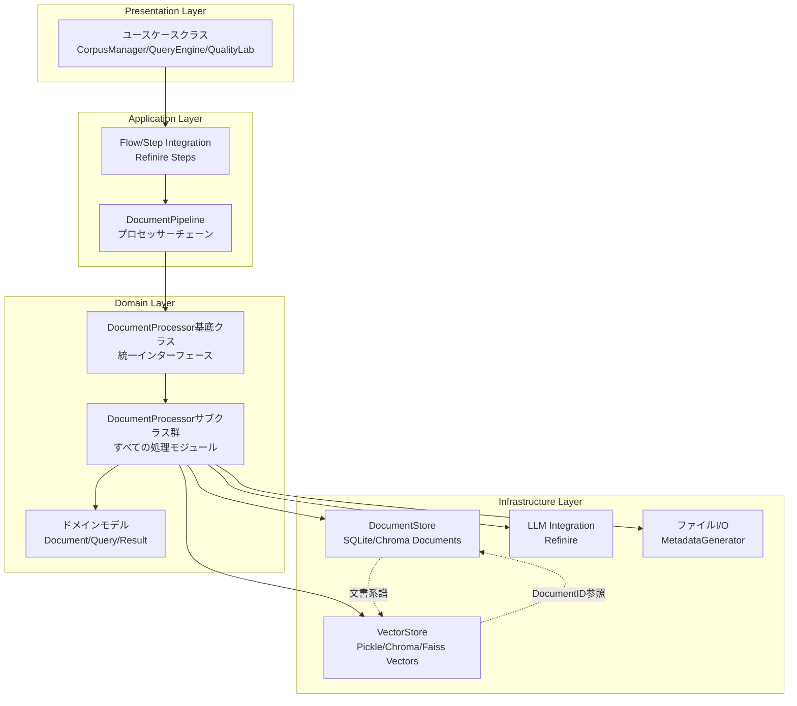
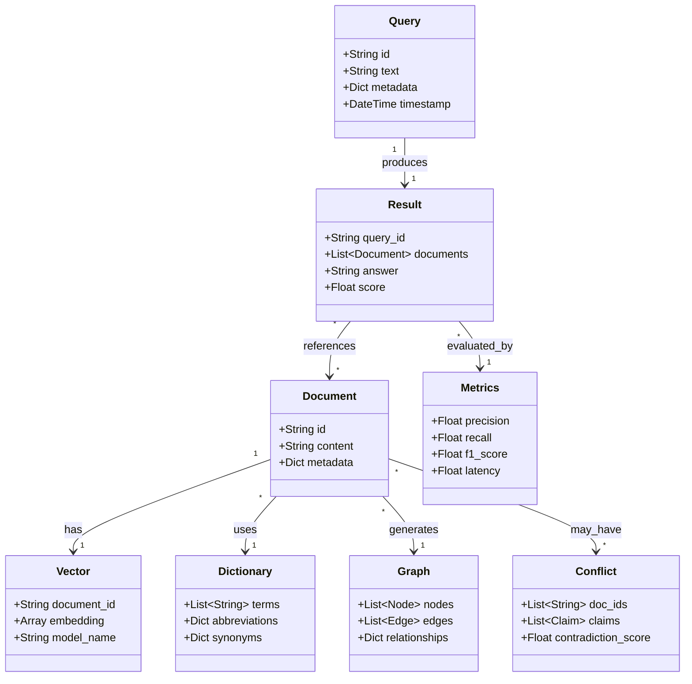
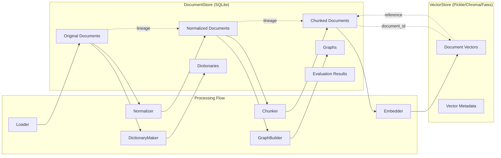

# アーキテクチャ設計書

## システム構成・アーキテクチャの概要

refinire-ragは、クリーンアーキテクチャの原則に基づいた階層型アーキテクチャを採用します。各層は以下の責務を持ちます：

### レイヤー構造



### DocumentProcessor統一アーキテクチャの利点

#### 1. 統一インターフェースによる柔軟性
すべての処理モジュールがDocumentProcessorを継承することで：
- **パイプライン組み換え自由度**: 任意の順序でプロセッサーを組み合わせ可能
- **設定の型安全性**: 各プロセッサーが独自の設定クラスを持ち、型チェックが効く
- **統計情報の一元管理**: すべてのプロセッサーが統一された統計情報を提供

#### 2. 統合ストアアーキテクチャ（2024年12月更新）
**VectorStore**と**KeywordSearch**は、プロセッサーラッパーを廃止し、直接DocumentProcessorを継承：
- **VectorStore**: `DocumentProcessor` + `Indexer` + `Retriever` を統合実装
- **KeywordSearch**: `DocumentProcessor` + `Indexer` + `Retriever` を統合実装
- **利点**: ラッパークラス不要、直接パイプライン使用、シンプルな構成

```python
# 従来（ラッパー方式）
vector_store = InMemoryVectorStore()
processor = VectorStoreProcessor(vector_store)  # ラッパー必要
pipeline = DocumentPipeline([processor])

# 現在（統合方式）
vector_store = InMemoryVectorStore()  # DocumentProcessor直接継承
vector_store.set_embedder(embedder)   # 直接設定
pipeline = DocumentPipeline([vector_store])  # 直接使用
```

#### 3. 依存性注入（DI）による切り替え自由度
各ユースケースクラスとプロセッサーは、背後モジュールをDIによって注入可能：
- **ベクトルストア切り替え**: InMemory ↔ Chroma ↔ Faiss
- **Embeddingモデル切り替え**: TF-IDF ↔ OpenAI ↔ HuggingFace
- **LLMプロバイダ切り替え**: OpenAI ↔ Anthropic ↔ Gemini ↔ Ollama
- **DocumentStore切り替え**: SQLite ↔ PostgreSQL ↔ MongoDB

#### 4. 処理の透明性と追跡可能性
- **文書系譜管理**: original_document_id, parent_document_idによる完全な系譜追跡
- **処理段階管理**: processing_stageによる各段階の明確化
- **メタデータ富化**: 各プロセッサーが段階的にメタデータを充実
- **エラー追跡**: 各プロセッサーレベルでのエラーハンドリングと統計

## 主要インターフェース

### ユースケースクラス一覧

| クラス名 | 責務 | 主要メソッド | 継承元 |
|---|---|---|---|
| CorpusManager | 文書コーパスの構築・管理 | add_documents(), generate_dictionary(), generate_graph() | Refinire Step |
| QueryEngine | クエリに対する回答生成 | answer() | Refinire Step |
| QualityLab | 品質評価・改善 | run_evaluation(), detect_conflicts(), generate_report() | Refinire Step |

### DocumentProcessor統一アーキテクチャ

すべてのデータ処理モジュールは**DocumentProcessor**を継承し、統一されたインターフェースを提供します。これにより柔軟なパイプライン構築が可能です。

#### DocumentProcessorサブクラス一覧

| クラス名 | 責務 | 設定クラス | 主要機能 |
|---|---|---|---|
| Loader | ファイル読み込み・変換 | LoaderConfig | ファイル → Document変換、メタデータ生成 |
| DictionaryMaker | ドメイン固有用語抽出・辞書更新 | DictionaryMakerConfig | LLMベース用語抽出、表現揺らぎ検出、MD辞書更新 |
| Normalizer | 表現揺らぎ正規化 | NormalizerConfig | MD辞書ベース表現統一、揺らぎ訂正 |
| GraphBuilder | 知識グラフ累積構築 | GraphBuilderConfig | LLMベース関係抽出、MD形式グラフ累積更新 |
| Chunker | 文書分割・チャンク化 | ChunkingConfig | トークンベース分割、オーバーラップ |
| **VectorStore** | **ベクトル化・保存・検索** | **VectorStoreConfig** | **埋め込み生成、ベクトル保存、類似度検索** |
| **KeywordSearch** | **キーワード検索・インデックス** | **KeywordSearchConfig** | **テキスト検索、インデックス管理** |
| Reranker | 候補再順位付け | RerankerConfig | 検索結果再ランキング |
| Reader | 回答生成・読解 | ReaderConfig | LLMベース回答生成 |
| TestSuite | 評価実行 | TestSuiteConfig | テストケース実行 |
| Evaluator | メトリクス計算 | EvaluatorConfig | 精度・再現率等計算 |
| ContradictionDetector | 矛盾検出 | ContradictionDetectorConfig | 文書間矛盾検出 |
| InsightReporter | レポート生成 | InsightReporterConfig | 分析レポート作成 |

#### DocumentProcessor統一インターフェース

```python
class DocumentProcessor(ABC):
    def __init__(self, config: DocumentProcessorConfig)
    
    @classmethod
    @abstractmethod
    def get_config_class(cls) -> Type[DocumentProcessorConfig]
    
    @abstractmethod
    def process(self, document: Document, config: Optional[Any] = None) -> List[Document]
    
    def process_with_stats(self, document: Document, config: Optional[Any] = None) -> List[Document]
    def get_processing_stats(self) -> Dict[str, Any]
```

#### DocumentPipeline による処理チェーン

```python
# 文書処理パイプラインの例（統合アーキテクチャ）
# VectorStoreを直接使用 - プロセッサーラッパーは不要
vector_store = InMemoryVectorStore()
vector_store.set_embedder(OpenAIEmbedder())

pipeline = DocumentPipeline([
    Loader(LoaderConfig(source_paths=["./docs"])),
    DictionaryMaker(DictionaryMakerConfig(extract_abbreviations=True)),
    Normalizer(NormalizerConfig(apply_abbreviation_expansion=True)),
    Chunker(ChunkingConfig(chunk_size=512, overlap=50)),
    vector_store  # VectorStoreを直接パイプラインで使用
])

# 統計追跡付きで一括処理
results = pipeline.process_documents(documents)
stats = pipeline.get_pipeline_stats()
```

### インフラストラクチャ層インターフェース

| インターフェース | 責務 | 実装例 | 統合機能 |
|---|---|---|---|
| DocumentStore | 文書永続化・検索 | SQLiteDocumentStore, ChromaDocumentStore | - |
| **VectorStore** | **ベクトル保存・検索・インデックス** | **InMemoryVectorStore, PickleVectorStore** | **DocumentProcessor + Indexer + Retriever** |
| **KeywordSearch** | **キーワード検索・インデックス** | **SimpleKeywordSearch** | **DocumentProcessor + Indexer + Retriever** |
| Embedder | ベクトル埋め込み | TFIDFEmbedder, OpenAIEmbedder | - |
| MetadataGenerator | メタデータ生成 | PathBasedMetadataGenerator | - |

## 主要データ（データの種類、構造）

### データクラス一覧

| クラス名 | 保持するデータ | 用途 |
|---|---|---|
| Document | id, content, metadata | 文書の基本単位（Chunkも同じDocumentクラスを使用、metadataは自由な辞書型） |
| Vector | document_id, embedding, model_name | ベクトル表現 |
| Query | id, text, metadata, timestamp | 検索クエリ |
| Result | query_id, documents, answer, score | 検索・回答結果 |
| Dictionary | terms, abbreviations, synonyms | 用語辞書 |
| Graph | nodes, edges, relationships | 知識グラフ |
| Metrics | precision, recall, f1, latency | 評価メトリクス |
| Conflict | doc_ids, claims, contradiction_score | 矛盾情報 |
| Config | embedder_config, store_config, llm_config | 設定情報 |

### データモデル関係図



## データフローと永続化戦略

### DocumentStoreとVectorStoreの分離



### 文書の系譜管理

各文書は以下の系譜情報を持ちます：

```python
# オリジナル文書
original_doc.metadata = {
    "original_document_id": None,  # これがルート
    "parent_document_id": None,
    "processing_stage": "original"
}

# 正規化文書
normalized_doc.metadata = {
    "original_document_id": "doc_001",
    "parent_document_id": "doc_001", 
    "processing_stage": "normalized"
}

# チャンク文書
chunk_doc.metadata = {
    "original_document_id": "doc_001",
    "parent_document_id": "doc_001_normalized",
    "processing_stage": "chunked",
    "chunk_position": 0,
    "chunk_total": 10
}
```

### 検索とデータ取得の最適化

1. **ベクトル検索**: VectorStoreで高速検索
2. **完全データ取得**: DocumentStoreから詳細メタデータ取得
3. **系譜追跡**: original_document_idで関連文書を一括取得
4. **メタデータフィルタ**: DocumentStoreの強力な検索機能

## 設定管理

YAMLファイルとPydanticを使用した型安全な設定管理を実装します：

```yaml
# config.yaml の例
embedder:
  type: "openai"
  model: "text-embedding-ada-002"
  
store:
  type: "chroma"
  persist_directory: "./chroma_db"
  
llm:
  provider: "openai"
  model: "gpt-4o-mini"
  temperature: 0.7
  
chunker:
  chunk_size: 512
  overlap: 50
```

## エラーハンドリング

階層化された例外クラスを定義：

```
RefinireRAGError (基底クラス)
├── CorpusError (コーパス管理関連)
├── QueryError (クエリ処理関連)
└── EvaluationError (評価処理関連)
```

## モニタリング・トレーシング

OpenTelemetryを使用して、各ユースケースの実行をトレース：

- 各Stepの実行時間
- LLM APIコール数と応答時間
- ベクトル検索のレイテンシ
- チャンク処理のスループット