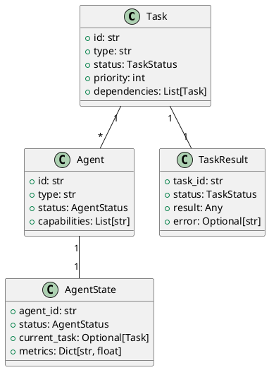

# Refinire Orchestrator Agent アーキテクチャ設計書

## システム構成・アーキテクチャの概要

本システムは、クリーンアーキテクチャの原則に基づいて設計されています。以下のレイヤーで構成されます：

1. **プレゼンテーション層**
   - ユーザーインターフェース
   - APIエンドポイント

2. **アプリケーション層**
   - オーケストレーターエージェント
   - タスク管理
   - エージェント管理

3. **ドメイン層**
   - タスクモデル
   - エージェントモデル
   - 状態管理

4. **インフラストラクチャ層**
   - データベースアクセス
   - 外部サービス連携
   - ロギング

## 主要インターフェース

| クラス名 | 責務 | レイヤー |
|----------|------|----------|
| OrchestratorAgent | エージェントのオーケストレーション | アプリケーション層 |
| TaskManager | タスクの管理と割り当て | アプリケーション層 |
| AgentManager | ワーカーエージェントの管理 | アプリケーション層 |
| TaskAnalyzer | タスクの分析と分解 | ドメイン層 |
| StateManager | エージェント状態の管理 | ドメイン層 |
| DatabaseRepository | データの永続化 | インフラストラクチャ層 |

## 主要データ（データの種類、構造）

| クラス名 | 説明 | 主要な属性 |
|----------|------|------------|
| Task | 実行タスク | id, type, status, priority, dependencies |
| Agent | ワーカーエージェント | id, type, status, capabilities |
| TaskResult | タスク実行結果 | task_id, status, result, error |
| AgentState | エージェント状態 | agent_id, status, current_task, metrics |

