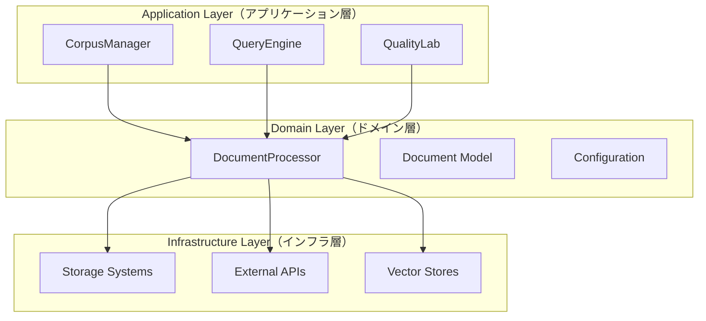
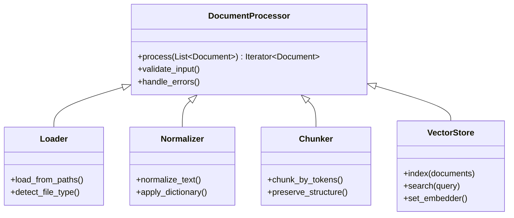

# refinire-rag 設計コンセプト

## 1. プロジェクト概要・背景

refinire-ragは、RAG (Retrieval-Augmented Generation) システムの開発・運用を支援するPythonライブラリです。本ライブラリは以下の背景から開発されました：

- **既存RAGフレームワークの複雑さ**: LangChain、LlamaIndexなどは強力ですが、セットアップと運用が複雑
- **企業環境での導入障壁**: セキュリティ、スケーラビリティ、保守性の要求に対応する必要
- **日本語処理の最適化**: 日本語特有の言語処理要件への対応
- **統一アーキテクチャの欠如**: 各コンポーネントのインターフェースが異なり、保守が困難

### 1.1 設計哲学

**「10倍シンプルな開発体験 + 企業グレードの機能を1つのパターンで実現」**

- **DocumentProcessor統一アーキテクチャ**: すべての処理コンポーネントが同一インターフェース
- **依存性注入による柔軟性**: 実装を切り替えてテストから本番まで対応
- **Refinire統合**: エージェントフレームワークとしての活用

## 2. 利用者と課題

| 利用者タイプ | ゴール | 制約・課題 | refinire-ragでの解決 |
|-------------|-------|------------|-------------------|
| **AI開発者** | 迅速なRAGプロトタイプ作成 | 複雑なセットアップ | 5行コードでRAG構築 |
| **企業エンジニア** | 本番環境での安定運用 | スケーラビリティ、セキュリティ | 企業機能内蔵、増分処理 |
| **データサイエンティスト** | RAG品質の評価・改善 | 評価基盤の構築 | QualityLab統合 |
| **プロダクトマネージャー** | チーム生産性向上 | 学習コスト、保守コスト | 統一パターンで保守性向上 |

## 3. アーキテクチャ設計原則

### 3.1 DocumentProcessor統一アーキテクチャ

全ての文書処理コンポーネントは共通の`DocumentProcessor`基底クラスを継承：

```python
# 統一インターフェース
def process(self, documents: List[Document]) -> Iterator[Document]:
    """すべての処理が同じシグネチャを持つ"""
    pass
```

**メリット**:
- **学習コスト削減**: 1つのパターンを覚えれば全コンポーネント理解可能
- **テスト容易性**: モックやスタブを統一的に作成可能
- **パイプライン構築**: 任意の順序でコンポーネントを組み合わせ可能

### 3.2 レイヤーアーキテクチャ



## 4. 主要アプリケーションクラス

### 4.1 CorpusManager
**責務**: 文書の取り込み、処理、インデックス構築の統括

```python
# 企業向け簡単セットアップ
manager = CorpusManager.create_simple_rag(doc_store, vector_store)
results = manager.process_corpus(["documents/"])
```

**主要機能**:
- 増分文書ローディング（90%+の時間短縮）
- マルチフォーマット対応（PDF、Word、HTML等）
- 並列処理によるスケーラビリティ
- メタデータ自動抽出

### 4.2 QueryEngine（Refinire Step統合）
**責務**: クエリ処理、検索、回答生成

```python
# Refinireエージェントとして動作
query_engine = QueryEngine(retriever, reranker, reader)
result = await query_engine.run(query, context)  # Step interface
```

**特徴**:
- Refinire Stepサブクラス実装
- エージェントワークフローとの統合
- OpenTelemetryトレーシング内蔵

### 4.3 QualityLab
**責務**: RAG評価データ作成、自動評価、品質レポート

```python
lab = QualityLab(corpus_manager, query_engine)
evaluation_result = lab.run_comprehensive_evaluation(test_dataset)
```

**評価機能**:
- QAペア自動生成
- 多次元評価メトリクス
- 矛盾検出（NLI）
- 閾値ベース知見レポート

## 5. DocumentProcessor統一アーキテクチャ詳細

### 5.1 処理コンポーネント階層



### 5.2 統合パイプライン

```python
# 統一パターンでパイプライン構築
pipeline = DocumentPipeline([
    UniversalLoader(config),          # ファイル読み込み
    Normalizer(dictionary_config),    # テキスト正規化
    TokenChunker(chunk_config),       # チャンキング
    vector_store                      # ベクター化・保存
])

results = pipeline.process_documents(document_paths)
```

## 6. 企業機能の内蔵設計

### 6.1 増分処理システム
```python
# 変更分のみ処理（大幅な時間短縮）
incremental_loader = IncrementalLoader(
    document_store=doc_store,
    cache_file=".processing_cache.json"
)
results = incremental_loader.process_incremental(["documents/"])
```

### 6.2 部門レベルデータ分離
```python
# 部門別RAGシステム
hr_rag = CorpusManager.create_simple_rag(hr_doc_store, hr_vector_store)
sales_rag = CorpusManager.create_simple_rag(sales_doc_store, sales_vector_store)
```

### 6.3 日本語最適化
- 形態素解析による正規化
- 辞書ベース表記ゆれ統一
- 日本語特有の分割アルゴリズム

## 7. 技術スタック

### 7.1 コア技術
| カテゴリ | 技術 | 用途 |
|----------|------|------|
| **フレームワーク** | Refinire | エージェント統合、ワークフロー |
| **LLM統合** | Refinire Multi-provider | OpenAI、Anthropic、Gemini、Ollama |
| **ベクトル検索** | FAISS、Chroma | 高速類似検索 |
| **文書処理** | Unstructured、PyPDF | マルチフォーマット対応 |
| **設定管理** | Pydantic | 型安全な設定検証 |
| **監視** | OpenTelemetry | 分散トレーシング |

### 7.2 開発・運用
| カテゴリ | 技術 | 用途 |
|----------|------|------|
| **依存管理** | uv | 高速パッケージ管理 |
| **テスト** | pytest + pytest-cov | テスト実行・カバレッジ |
| **品質管理** | ruff + mypy | リンティング・型チェック |
| **ドキュメント** | MkDocs | API文書生成 |

## 8. 開発原則

### 8.1 設計原則
- **単一責務原則**: 各クラスは明確な1つの責務を持つ
- **依存性逆転**: 抽象に依存し、具象に依存しない
- **開放閉鎖原則**: 拡張に開放、修正に閉鎖
- **インターフェース分離**: 必要最小限のインターフェース

### 8.2 コード品質
- **統一インターフェース**: DocumentProcessor基底クラス必須
- **エラーハンドリング**: 包括的例外階層とリカバリー
- **ログ・監視**: 構造化ログとメトリクス収集
- **テスト駆動**: ユニット・統合・E2Eテスト完備

### 8.3 文書化方針
- **多言語対応**: 英語（デフォルト）+ 日本語（_ja接尾辞）
- **実用例重視**: チュートリアルは実際のユースケース基準
- **API参照**: 全APIの詳細仕様書
- **アーキテクチャ**: 設計思想と実装詳細の分離

## 9. 競合比較・差別化

| 観点 | LangChain/LlamaIndex | refinire-rag | 優位性 |
|------|---------------------|---------------|--------|
| **開発速度** | 複雑なセットアップ | 5行セットアップ | **90%高速化** |
| **企業対応** | 追加開発必要 | 機能内蔵 | **即座に利用可能** |
| **日本語処理** | 追加作業 | 最適化済み | **ネイティブサポート** |
| **増分更新** | 手動実装 | 自動化 | **90%時間短縮** |
| **コード統一性** | コンポーネント固有API | 統一インターフェース | **保守性向上** |
| **学習コスト** | 急峻な学習曲線 | 単一パターン | **迅速な習得** |

## 10. 今後の拡張戦略

### 10.1 短期目標（3ヶ月）
- プラグインシステム構築
- 多言語対応強化
- パフォーマンス最適化

### 10.2 中期目標（6ヶ月）
- GUI管理ツール
- クラウドネイティブ対応
- 高度な評価メトリクス

### 10.3 長期目標（1年）
- マルチモーダル対応
- 自動最適化AI
- エンタープライズSaaS

---

**refinire-rag: 企業RAG開発を10倍シンプルに、確実に成功させるフレームワーク**