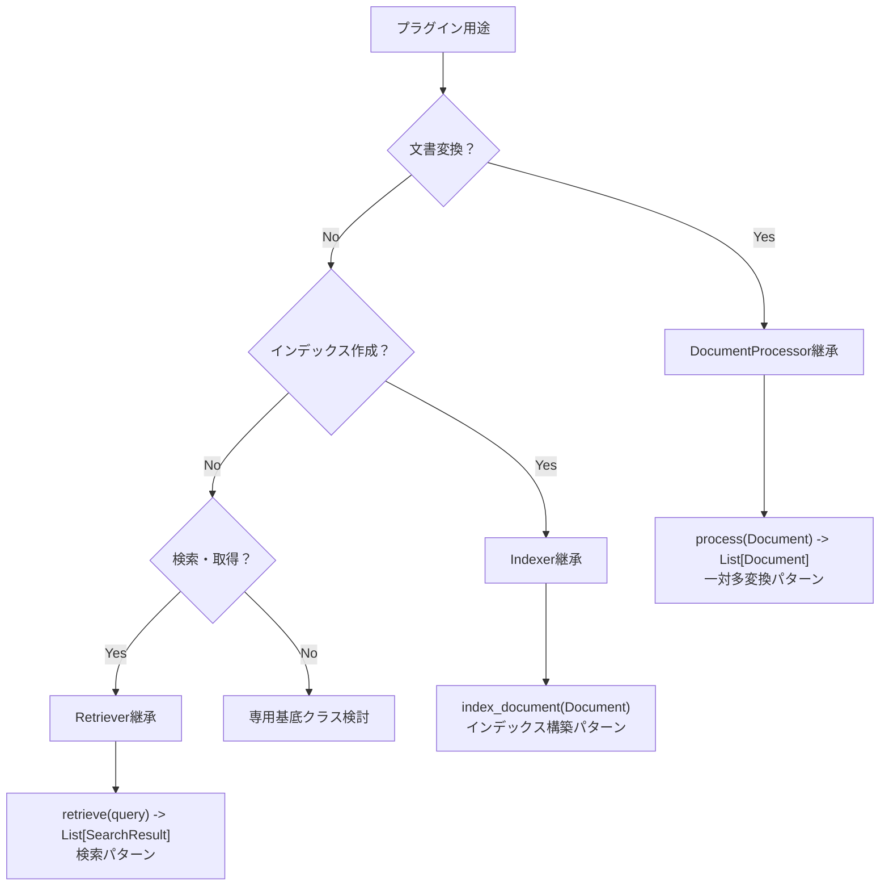
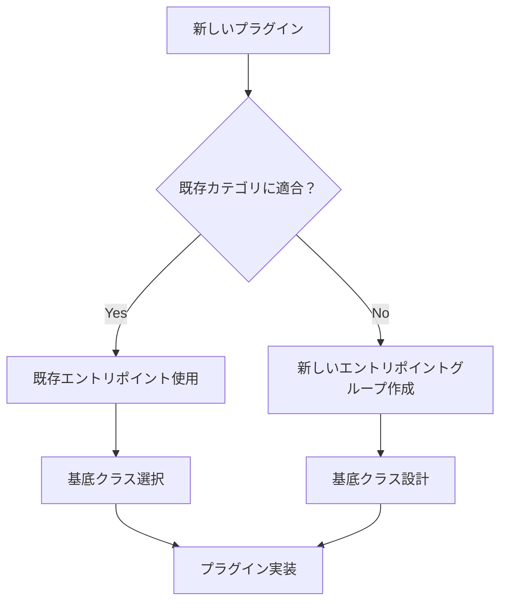

# Plugin Development Guide

## 概要

refinire-ragは環境変数ベースのプラグインアーキテクチャを採用しており、Retriever、VectorStore、DocumentStoreなどのコンポーネントを独立したパッケージとして開発・配布できます。現在はChroma・BM25sプラグインが利用可能で、将来的には様々なコンポーネントのプラグイン化が予定されています。本ガイドでは、統一設定パターン、基底クラス選択指針、エントリポイント設計を中心としたプラグインの設計方法について説明します。

## 目次

1. [プラグイン設計原則](#プラグイン設計原則) - 統一設定アーキテクチャと推奨パターン
2. [基底クラス選択ガイド](#基底クラス選択ガイド) - 用途別の基底クラス選択フローチャート
3. [エントリポイント設計指針](#エントリポイント設計指針) - プラグインタイプ別のエントリポイント設計
4. [プラグインの種類](#プラグインの種類) - 利用可能なプラグインタイプ一覧
5. [統一設定パターン実装](#統一設定パターン実装) - **kwargs コンストラクタの実装方法
6. [プラグイン設計ベストプラクティス](#プラグイン設計ベストプラクティス) - 設計原則とチェックリスト

## プラグイン設計原則

### 統一設定アーキテクチャ

すべてのプラグインは統一された設定パターンに従います：

#### ✅ 推奨設計パターン

1. **`**kwargs`コンストラクタ**：環境変数自動読み込み
   ```python
   def __init__(self, **kwargs):
       # 環境変数とkwargsを統合した設定処理
   ```

2. **設定優先順位**：`kwargs > 環境変数 > デフォルト値`

3. **`get_config()`メソッド**：現在の設定を辞書で返却

4. **環境変数命名規則**：`REFINIRE_RAG_{COMPONENT_TYPE}_{SETTING_NAME}`

#### ❌ 非推奨パターン

- `from_env()`メソッド（冗長なため削除済み）
- Config オブジェクト引数（統一性を損なうため）

### プラグインアーキテクチャの設計思想

#### 統合レジストリシステム

refinire-ragは内蔵コンポーネントと外部プラグインを統一的に管理するレジストリシステムを採用しています：

- **内蔵コンポーネント**：refinire-ragに標準で組み込まれているコンポーネント（エントリポイント不要）
- **外部プラグイン**：独立したパッケージとして配布されるプラグイン（エントリポイント使用）
- **統一アクセス**：どちらも同じAPI（`PluginRegistry`）で利用可能

#### 環境変数ベース設定

内蔵・外部問わず、同じ環境変数命名規則に従います：

```bash
# メインの設定（内蔵＋外部プラグイン混在可能）
REFINIRE_RAG_RETRIEVERS=inmemory_vector,chroma,bm25s  # 内蔵,外部,外部
REFINIRE_RAG_DOCUMENT_STORES=sqlite                   # 内蔵

# プラグイン固有の設定（外部プラグインのみ）
REFINIRE_RAG_CHROMA_HOST=localhost
REFINIRE_RAG_CHROMA_PORT=8000
REFINIRE_RAG_BM25S_INDEX_PATH=./bm25s_index
```

### 内蔵コンポーネントの自動登録

システム起動時に内蔵コンポーネントが自動的にレジストリに登録されます：

```python
# 利用可能なコンポーネント確認（内蔵＋外部）
from refinire_rag.registry import PluginRegistry

vector_stores = PluginRegistry.list_available_plugins('vector_stores')
# 結果例: ['inmemory_vector', 'pickle_vector', 'chroma']  # 内蔵,内蔵,外部

# 内蔵かどうかの判定
is_builtin = PluginRegistry.is_builtin('vector_stores', 'inmemory_vector')  # True
```

### oneenvとの統合

各プラグインは独自のoneenvテンプレートを提供し、環境変数の管理を統一的に行います。

### Entry Pointsによる外部プラグイン発見

外部プラグインは`pyproject.toml`のentry pointsを通じて自動的に発見され、内蔵コンポーネントと統合されます。

## プラグインの種類

refinire-ragでは以下のコンポーネントがプラグイン化可能です：

### 検索・取得系

| プラグインタイプ | Entry Points グループ | 責務 | 実装例 |
|---|---|---|---|
| **Retriever** | `refinire_rag.retrievers` | 文書検索とランキング | SimpleRetriever, HybridRetriever |
| **VectorStore** | `refinire_rag.vector_stores` | ベクトル保存と検索 | Chroma※, InMemoryVectorStore |
| **KeywordSearch** | `refinire_rag.keyword_stores` | キーワードベース検索 | BM25s※, TFIDFKeywordStore |
| **Reranker** | `refinire_rag.rerankers` | 検索結果の再ランキング | SimpleReranker（開発予定） |
| **AnswerSynthesizer** | `refinire_rag.synthesizers` | 回答生成・統合 | AnswerSynthesizer（開発予定） |

### 文書処理系

| プラグインタイプ | Entry Points グループ | 責務 | 実装例 |
|---|---|---|---|
| **DocumentProcessor** | `refinire_rag.processors` | 文書処理パイプライン | Normalizer, Chunker, DictionaryMaker |
| **Loader** | `refinire_rag.loaders` | 文書ロード・変換 | TextLoader, CSVLoader, HTMLLoader |
| **Splitter** | `refinire_rag.splitters` | 文書分割戦略 | RecursiveCharacterSplitter, CodeSplitter |
| **Filter** | `refinire_rag.filters` | ファイルフィルタリング | ExtensionFilter, SizeFilter, DateFilter |
| **Metadata** | `refinire_rag.metadata` | メタデータ付与 | FileInfoMetadata, PathMapMetadata |

### 埋め込み・ベクトル化系

| プラグインタイプ | Entry Points グループ | 責務 | 実装例 |
|---|---|---|---|
| **Embedder** | `refinire_rag.embedders` | テキストのベクトル化 | OpenAIEmbedder, TFIDFEmbedder |
| **VectorIndexer** | `refinire_rag.indexers` | ベクトルインデックス作成 | （開発予定） |

### 評価・品質管理系

| プラグインタイプ | Entry Points グループ | 責務 | 実装例 |
|---|---|---|---|
| **Evaluator** | `refinire_rag.evaluators` | 評価指標計算 | BLEUEvaluator, ROUGEEvaluator, LLMJudgeEvaluator |
| **ContradictionDetector** | `refinire_rag.contradiction_detectors` | 矛盾検出 | ContradictionDetector |
| **TestSuite** | `refinire_rag.test_suites` | テスト実行 | TestSuite |
| **InsightReporter** | `refinire_rag.reporters` | レポート生成 | InsightReporter |

### ストレージ系

| プラグインタイプ | Entry Points グループ | 責務 | 実装例 |
|---|---|---|---|
| **DocumentStore** | `refinire_rag.document_stores` | 文書メタデータ保存 | SQLiteStore |
| **EvaluationStore** | `refinire_rag.evaluation_stores` | 評価結果保存 | SQLiteEvaluationStore |
| **CorpusStore** | `refinire_rag.corpus_stores` | コーパス管理 | SQLiteCorpusStore |

### ナレッジ処理系

| プラグインタイプ | Entry Points グループ | 責務 | 実装例 |
|---|---|---|---|
| **DictionaryMaker** | `refinire_rag.dictionary_makers` | 専門用語辞書作成 | DictionaryMaker |
| **GraphBuilder** | `refinire_rag.graph_builders` | 知識グラフ構築 | GraphBuilder |
| **Normalizer** | `refinire_rag.normalizers` | テキスト正規化 | Normalizer |

**注：** ※マークがついているものは外部プラグインとして開発予定・可能なコンポーネントです。

## 基底クラス選択ガイド

プラグイン開発時の基底クラス選択フローチャート：

### 文書処理系プラグイン



### 検索・取得系プラグイン

| 用途 | 基底クラス | エントリポイント | 実装メソッド |
|------|------------|------------------|--------------|
| **純粋な検索** | `Retriever` | `refinire_rag.retrievers` | `retrieve()` |
| **ベクトル保存+検索** | `VectorStore` | `refinire_rag.vector_stores` | `add_vector()`, `search()` |
| **キーワード検索** | `KeywordSearch` | `refinire_rag.keyword_stores` | `add_document()`, `search()` |
| **検索結果再ランキング** | `Reranker` | `refinire_rag.rerankers` | `rerank()` |

### 複合インターフェース

一部のプラグインは複数のインターフェースを実装します：

```python
# 例：VectorStoreは3つのインターフェースを実装
class CustomVectorStore(VectorStore, DocumentProcessor, Indexer, Retriever):
    """
    - DocumentProcessor: process() メソッドで文書パイプライン統合
    - Indexer: index_document() メソッドでインデックス構築
    - Retriever: retrieve() メソッドで検索機能
    """
```

## エントリポイント設計指針

### エントリポイントグループ選択

| 機能カテゴリ | エントリポイントグループ | 用途 |
|--------------|-------------------------|------|
| **検索・取得** | `refinire_rag.retrievers` | 汎用的な文書検索 |
| | `refinire_rag.vector_stores` | ベクトルストレージ・検索 |
| | `refinire_rag.keyword_stores` | キーワードベース検索 |
| | `refinire_rag.rerankers` | 検索結果の再ランキング |
| **文書処理** | `refinire_rag.processors` | DocumentProcessor実装 |
| | `refinire_rag.loaders` | 文書ファイル読み込み |
| | `refinire_rag.splitters` | 文書分割・チャンク化 |
| **評価・品質** | `refinire_rag.evaluators` | 評価指標計算 |
| | `refinire_rag.test_suites` | テスト実行 |
| **ストレージ** | `refinire_rag.document_stores` | 文書メタデータ保存 |
| | `refinire_rag.evaluation_stores` | 評価結果保存 |

### 新しいプラグインタイプの設計

新しいプラグインタイプを追加する場合：

1. **責務の明確化**：単一責任の原則に従う
2. **エントリポイント命名**：`refinire_rag.{機能カテゴリ}` パターン
3. **基底クラス設計**：既存インターフェースとの整合性
4. **環境変数命名**：`REFINIRE_RAG_{新タイプ}_{設定名}` パターン

### プラグイン分類決定フロー



## プラグイン開発手順

### 1. プロジェクト構造

```
refinire-rag-chroma/
├── src/
│   └── refinire_rag_chroma/
│       ├── __init__.py
│       ├── retriever.py          # メインのRetrieverクラス
│       ├── vector_store.py       # ChromaVectorStoreクラス
│       ├── config.py             # 設定クラス
│       └── env_template.py       # oneenvテンプレート
├── tests/
├── pyproject.toml               # entry points設定
├── README.md
└── .env.template                # 環境変数テンプレート
```

### 2. pyproject.toml設定

#### Retriever/VectorStoreプラグインの例（Chroma）

```toml
[build-system]
requires = ["hatchling"]
build-backend = "hatchling.build"

[project]
name = "refinire-rag-chroma"
version = "0.1.0"
description = "Chroma integration plugin for refinire-rag"
dependencies = [
    "refinire-rag",
    "chromadb>=0.4.0",
    "oneenv>=0.3.0"
]

[project.entry-points."refinire_rag.retrievers"]
chroma = "refinire_rag_chroma:ChromaRetriever"

[project.entry-points."refinire_rag.vector_stores"]
chroma = "refinire_rag_chroma:ChromaVectorStore"

[project.entry-points."refinire_rag.oneenv_templates"]
chroma = "refinire_rag_chroma.env_template:chroma_env_template"
```

#### 評価プラグインの例（BERT Score）

```toml
[project]
name = "refinire-rag-bertscore"
version = "0.1.0"
description = "BERTScore evaluation plugin for refinire-rag"
dependencies = [
    "refinire-rag",
    "bert-score>=0.3.12",
    "oneenv>=0.3.0"
]

[project.entry-points."refinire_rag.evaluators"]
bertscore = "refinire_rag_bertscore:BERTScoreEvaluator"

[project.entry-points."refinire_rag.oneenv_templates"]
bertscore = "refinire_rag_bertscore.env_template:bertscore_env_template"
```

#### Rerankerプラグインの例（Sentence-BERT）

```toml
[project]
name = "refinire-rag-sbert-reranker"
version = "0.1.0"
description = "Sentence-BERT reranking plugin for refinire-rag"
dependencies = [
    "refinire-rag",
    "sentence-transformers>=2.2.0",
    "oneenv>=0.3.0"
]

[project.entry-points."refinire_rag.rerankers"]
sbert = "refinire_rag_sbert_reranker:SentenceBERTReranker"

[project.entry-points."refinire_rag.oneenv_templates"]
sbert_reranker = "refinire_rag_sbert_reranker.env_template:sbert_reranker_env_template"
```

### 3. oneenvテンプレート実装

```python
# src/refinire_rag_chroma/env_template.py
from oneenv import EnvTemplate, EnvVarConfig
from oneenv.templates import template_enhanced

@template_enhanced
def chroma_env_template() -> EnvTemplate:
    """Chroma plugin environment variables template
    
    Chromaプラグイン用環境変数テンプレート
    """
    return EnvTemplate(
        name="refinire-rag-chroma",
        description="Environment variables for Chroma integration",
        variables=[
            # Critical variables
            EnvVarConfig(
                name="REFINIRE_RAG_CHROMA_HOST",
                description="Chroma server host",
                default="localhost",
                importance="Critical",
                group="Connection"
            ),
            
            # Important variables
            EnvVarConfig(
                name="REFINIRE_RAG_CHROMA_PORT",
                description="Chroma server port",
                default="8000",
                importance="Important",
                group="Connection"
            ),
            EnvVarConfig(
                name="REFINIRE_RAG_CHROMA_COLLECTION",
                description="Default collection name",
                default="refinire_rag",
                importance="Important",
                group="Storage"
            ),
            EnvVarConfig(
                name="REFINIRE_RAG_CHROMA_DISTANCE_METRIC",
                description="Distance metric for similarity search",
                default="cosine",
                importance="Important",
                group="Search"
            ),
            
            # Optional variables
            EnvVarConfig(
                name="REFINIRE_RAG_CHROMA_BATCH_SIZE",
                description="Batch size for bulk operations",
                default="100",
                importance="Optional",
                group="Performance"
            )
        ],
        groups={
            "Connection": "Chroma server connection settings",
            "Storage": "Data storage configuration",
            "Search": "Search and retrieval settings",
            "Performance": "Performance optimization settings"
        }
    )
```

### 4. 統一設定パターン実装

すべてのプラグインは以下の統一設定パターンに従って実装します：

#### 統一設定パターンの設計思想

**なぜ統一設定パターンが重要か**

refinire-ragでは、全プラグインで一貫した設定パターンを採用することで以下の利点を実現しています：

1. **設定の一貫性**: 全プラグインが同じ優先順位ルール（kwargs > 環境変数 > デフォルト値）に従う
2. **運用の簡素化**: Docker・Kubernetes等でコンテナ環境変数による設定が可能
3. **テスト容易性**: kwargs経由でテスト用設定を直接注入可能
4. **デバッグ支援**: `get_config()`により現在の設定状態を常に確認可能
5. **セキュリティ**: 機密情報を環境変数で管理し、コードから分離

#### 設定優先順位の設計理由

**kwargs > 環境変数 > デフォルト値** の順序を採用する理由：

- **kwargs最優先**: プログラム内での明示的な設定変更を最重要視
- **環境変数次点**: デプロイメント時の柔軟な設定変更をサポート
- **デフォルト値最後**: 何も設定しなくても動作する安全なフォールバック

#### 基本実装テンプレート

```python
import os
from typing import Dict, Any

class PluginExample:
    """統一設定パターンの実装例"""
    
    def __init__(self, **kwargs):
        """統一設定パターンのコンストラクタ
        
        Args:
            **kwargs: 設定パラメータ
                     優先順位: kwargs > 環境変数 > デフォルト値
        """
        # 環境変数とkwargsの統合処理
        self.setting1 = kwargs.get('setting1', 
                                  os.getenv('REFINIRE_RAG_PLUGIN_SETTING1', 'default_value1'))
        self.setting2 = int(kwargs.get('setting2', 
                                      os.getenv('REFINIRE_RAG_PLUGIN_SETTING2', '42')))
        self.setting3 = kwargs.get('setting3', 
                                  os.getenv('REFINIRE_RAG_PLUGIN_SETTING3', 'default_value3'))
        
        # プラグイン固有の初期化処理
        self._initialize_plugin()
    
    def get_config(self) -> Dict[str, Any]:
        """現在の設定を辞書として返却
        
        統一インターフェースの必須メソッド
        """
        return {
            'setting1': self.setting1,
            'setting2': self.setting2,
            'setting3': self.setting3,
            'plugin_type': self.__class__.__name__
        }
    
    def _initialize_plugin(self):
        """プラグイン固有の初期化ロジック"""
        pass
```

#### 設定値の型変換ベストプラクティス

```python
def __init__(self, **kwargs):
    # 文字列設定
    self.host = kwargs.get('host', os.getenv('REFINIRE_RAG_PLUGIN_HOST', 'localhost'))
    
    # 数値設定（型変換エラーハンドリング付き）
    try:
        self.port = int(kwargs.get('port', os.getenv('REFINIRE_RAG_PLUGIN_PORT', '8080')))
    except (ValueError, TypeError):
        self.port = 8080  # デフォルト値にフォールバック
    
    # ブール設定
    self.enable_ssl = str(kwargs.get('enable_ssl', 
                                   os.getenv('REFINIRE_RAG_PLUGIN_SSL', 'false'))).lower() in ['true', '1', 'yes']
    
    # リスト設定（カンマ区切り文字列）
    raw_hosts = kwargs.get('hosts', os.getenv('REFINIRE_RAG_PLUGIN_HOSTS', 'localhost'))
    self.hosts = [h.strip() for h in raw_hosts.split(',') if h.strip()]
```

#### 複雑な設定パターン

```python
def __init__(self, **kwargs):
    # デフォルト設定の定義
    defaults = {
        'timeout': 30,
        'retry_count': 3,
        'batch_size': 100,
        'connection_pool_size': 10
    }
    
    # 環境変数プレフィックス
    env_prefix = 'REFINIRE_RAG_CUSTOM_PLUGIN'
    
    # 統合設定処理
    for key, default_value in defaults.items():
        env_key = f"{env_prefix}_{key.upper()}"
        
        # kwargs > 環境変数 > デフォルト値の優先順位
        if key in kwargs:
            value = kwargs[key]
        elif env_key in os.environ:
            value = os.environ[env_key]
            # 型変換（数値の場合）
            if isinstance(default_value, int):
                try:
                    value = int(value)
                except ValueError:
                    value = default_value
        else:
            value = default_value
        
        setattr(self, key, value)
```

### 5. 設定クラス実装（後方互換性用）

```python
# src/refinire_rag_chroma/config.py
import os
from dataclasses import dataclass
from typing import Optional

@dataclass
class ChromaConfig:
    """Configuration class for Chroma plugin
    
    Chromaプラグインの設定クラス
    """
    
    @property
    def host(self) -> str:
        return os.getenv("REFINIRE_RAG_CHROMA_HOST", "localhost")
    
    @property
    def port(self) -> int:
        return int(os.getenv("REFINIRE_RAG_CHROMA_PORT", "8000"))
    
    @property
    def collection_name(self) -> str:
        return os.getenv("REFINIRE_RAG_CHROMA_COLLECTION", "refinire_rag")
    
    @property
    def distance_metric(self) -> str:
        return os.getenv("REFINIRE_RAG_CHROMA_DISTANCE_METRIC", "cosine")
    
    @property
    def batch_size(self) -> int:
        return int(os.getenv("REFINIRE_RAG_CHROMA_BATCH_SIZE", "100"))
    
    @property
    def connection_url(self) -> str:
        return f"http://{self.host}:{self.port}"
```

### 5. Retrieverクラス実装

#### Retrieverプラグインの設計思想

**なぜRetrieverベースクラスを継承するのか**

ChromaRetrieverがRetrieverベースクラスを継承する設計理由：

1. **統一インターフェース**: 全検索プラグインが`search(query, top_k, filters)`で統一
2. **プラグイン互換性**: InMemoryRetriever、BM25Retrieverと完全に差し替え可能
3. **パイプライン統合**: QueryEngineが自動的にあらゆるRetrieverを利用可能
4. **品質保証**: 基底クラスが提供するエラーハンドリングとログ機能を継承

#### 遅延初期化パターンの採用理由

```python
@property
def client(self):
    """Lazy initialization of Chroma client"""
    if self._client is None:
        self._client = chromadb.HttpClient(...)
    return self._client
```

**設計意図**:
- **起動時間短縮**: プラグイン初期化時にはChromaサーバーに接続せず、実際の使用時まで遅延
- **エラー分離**: 設定エラーと接続エラーを分離し、デバッグを容易化
- **リソース効率**: 使用されないプラグインはネットワークリソースを消費しない

```python
# src/refinire_rag_chroma/retriever.py
import logging
from typing import List, Dict, Any, Optional
import chromadb
from chromadb.config import Settings

from refinire_rag.retrieval.base import Retriever
from refinire_rag.models.document import Document
from refinire_rag.models.search_result import SearchResult
from .config import ChromaConfig

logger = logging.getLogger(__name__)

class ChromaRetriever(Retriever):
    """Chroma-based document retriever
    
    Chromaベースの文書検索器
    """
    
    def __init__(self, **kwargs):
        """Initialize ChromaRetriever with environment variable support
        
        ChromaRetrieverを環境変数サポート付きで初期化
        
        Args:
            **kwargs: Configuration parameters, supporting:
                     host: Chroma host (REFINIRE_RAG_CHROMA_HOST)
                     port: Chroma port (REFINIRE_RAG_CHROMA_PORT)
                     collection_name: Collection name (REFINIRE_RAG_CHROMA_COLLECTION)
        """
        super().__init__(**kwargs)
        
        # Environment variable support with priority: kwargs > env vars > defaults
        import os
        self.host = kwargs.get('host', os.getenv('REFINIRE_RAG_CHROMA_HOST', 'localhost'))
        self.port = int(kwargs.get('port', os.getenv('REFINIRE_RAG_CHROMA_PORT', '8000')))
        self.collection_name = kwargs.get('collection_name', 
                                         os.getenv('REFINIRE_RAG_CHROMA_COLLECTION', 'documents'))
        self._client = None
        self._collection = None
        
        logger.info(f"Initialized ChromaRetriever with host: {self.host}:{self.port}")
    
    @property
    def client(self):
        """Lazy initialization of Chroma client
        
        Chromaクライアントの遅延初期化
        """
        if self._client is None:
            self._client = chromadb.HttpClient(
                host=self.config.host,
                port=self.config.port,
                settings=Settings()
            )
        return self._client
    
    @property
    def collection(self):
        """Get or create collection
        
        コレクションの取得または作成
        """
        if self._collection is None:
            try:
                self._collection = self.client.get_collection(
                    name=self.config.collection_name
                )
            except Exception:
                # Collection doesn't exist, create it
                self._collection = self.client.create_collection(
                    name=self.config.collection_name,
                    metadata={"hnsw:space": self.config.distance_metric}
                )
                logger.info(f"Created new collection: {self.config.collection_name}")
        return self._collection
    
    def search(self, 
               query: str, 
               top_k: int = 10,
               filters: Optional[Dict[str, Any]] = None) -> List[SearchResult]:
        """Search for documents using Chroma
        
        Chromaを使用して文書を検索
        
        Args:
            query: Search query string
                  検索クエリ文字列
            top_k: Number of results to return
                  返却する結果数
            filters: Optional metadata filters
                    オプションのメタデータフィルター
        
        Returns:
            List of search results
            検索結果のリスト
        """
        try:
            # Prepare where clause for filtering
            where_clause = None
            if filters:
                where_clause = self._convert_filters_to_where_clause(filters)
            
            # Perform search
            results = self.collection.query(
                query_texts=[query],
                n_results=top_k,
                where=where_clause
            )
            
            # Convert to SearchResult objects
            search_results = []
            for i in range(len(results['ids'][0])):
                search_result = SearchResult(
                    document_id=results['ids'][0][i],
                    content=results['documents'][0][i],
                    score=1.0 - results['distances'][0][i],  # Convert distance to similarity
                    metadata=results['metadatas'][0][i] or {}
                )
                search_results.append(search_result)
            
            logger.info(f"Retrieved {len(search_results)} documents for query: {query[:50]}...")
            return search_results
            
        except Exception as e:
            logger.error(f"Error searching in Chroma: {e}")
            return []
    
    def _convert_filters_to_where_clause(self, filters: Dict[str, Any]) -> Dict[str, Any]:
        """Convert refinire-rag filters to Chroma where clause
        
        refinire-ragフィルターをChroma where句に変換
        """
        # Simple implementation - can be extended for complex filtering
        return filters
    
    def add_documents(self, documents: List[Document]) -> bool:
        """Add documents to Chroma collection
        
        Chromaコレクションに文書を追加
        """
        try:
            # Prepare data for batch insertion
            ids = [doc.id for doc in documents]
            documents_text = [doc.content for doc in documents]
            metadatas = [doc.metadata for doc in documents]
            
            # Add to collection in batches
            batch_size = self.config.batch_size
            for i in range(0, len(documents), batch_size):
                batch_ids = ids[i:i + batch_size]
                batch_docs = documents_text[i:i + batch_size]
                batch_meta = metadatas[i:i + batch_size]
                
                self.collection.add(
                    ids=batch_ids,
                    documents=batch_docs,
                    metadatas=batch_meta
                )
            
            logger.info(f"Added {len(documents)} documents to Chroma collection")
            return True
            
        except Exception as e:
            logger.error(f"Error adding documents to Chroma: {e}")
            return False
    
    def clear(self) -> bool:
        """Clear all documents from collection
        
        コレクションからすべての文書を削除
        """
        try:
            # Delete the collection and recreate it
            self.client.delete_collection(name=self.config.collection_name)
            self._collection = None  # Reset collection reference
            
            logger.info(f"Cleared Chroma collection: {self.config.collection_name}")
            return True
            
        except Exception as e:
            logger.error(f"Error clearing Chroma collection: {e}")
            return False
```

### 6. パッケージ初期化

```python
# src/refinire_rag_chroma/__init__.py
"""
Chroma integration plugin for refinire-rag

This plugin provides Chroma database integration for vector storage and retrieval.

Environment Variables:
- REFINIRE_RAG_CHROMA_HOST: Chroma server host (default: localhost)
- REFINIRE_RAG_CHROMA_PORT: Chroma server port (default: 8000)
- REFINIRE_RAG_CHROMA_COLLECTION: Collection name (default: refinire_rag)
- REFINIRE_RAG_CHROMA_DISTANCE_METRIC: Distance metric (default: cosine)
- REFINIRE_RAG_CHROMA_BATCH_SIZE: Batch size for operations (default: 100)
"""

from .retriever import ChromaRetriever
from .vector_store import ChromaVectorStore
from .config import ChromaConfig

__all__ = ['ChromaRetriever', 'ChromaVectorStore', 'ChromaConfig']
__version__ = '0.1.0'
```

## 評価プラグインの実装例

### BERTScoreEvaluatorプラグイン

#### 評価プラグインの設計思想

**なぜReferenceBasedEvaluatorを継承するのか**

BERTScoreEvaluatorがReferenceBasedEvaluatorを継承する設計理由：

1. **評価タイプの明確化**: 参照ベース評価（予測結果と正解の比較）であることを型レベルで保証
2. **インターフェース統一**: 他の参照ベース評価器（ROUGE、BLEU等）と完全に互換
3. **品質保証**: 基底クラスが提供する評価結果の検証・正規化機能を継承
4. **パイプライン統合**: QualityLabが自動的にあらゆる評価器を利用可能

#### BERTScoreの技術的優位性

**従来のROUGE・BLEUとの違い**：
- **意味理解**: 単純な文字列マッチではなく、BERTによるセマンティック類似度を計算
- **言語対応**: 多言語BERTモデルにより、日本語等でも高精度な評価が可能
- **文脈考慮**: トークンの文脈を考慮した評価により、より人間の判断に近い結果

#### 評価結果の構造化の重要性

```python
return EvaluationResult(
    metric_name="bertscore",
    overall_score=f1_score,
    component_scores={
        "precision": precision,
        "recall": recall,
        "f1_score": f1_score
    },
    individual_scores=individual_scores
)
```

**設計意図**:
- **aggregation対応**: 複数評価指標の統合集計を可能に
- **詳細分析**: 個別ケースの詳細分析により、システム改善点を特定
- **品質監視**: 時系列での評価結果追跡により、モデル劣化を早期検出

```python
# src/refinire_rag_bertscore/evaluator.py
import logging
from typing import List, Dict, Any, Optional
from bert_score import score

from refinire_rag.evaluation.base_evaluator import ReferenceBasedEvaluator
from refinire_rag.models.evaluation_result import EvaluationResult
from .config import BERTScoreConfig

logger = logging.getLogger(__name__)

class BERTScoreEvaluator(ReferenceBasedEvaluator):
    """BERTScore-based evaluation for semantic similarity
    
    BERTScoreによるセマンティック類似度評価
    """
    
    def __init__(self, **kwargs):
        """Initialize BERTScoreEvaluator with environment variable support
        
        BERTScoreEvaluatorを環境変数サポート付きで初期化
        
        Args:
            **kwargs: Configuration parameters, supporting:
                     model_type: BERT model type (REFINIRE_RAG_BERTSCORE_MODEL)
                     num_layers: Number of layers (REFINIRE_RAG_BERTSCORE_LAYERS)
                     lang: Language code (REFINIRE_RAG_BERTSCORE_LANG)
        """
        super().__init__(**kwargs)
        
        # Environment variable support with priority: kwargs > env vars > defaults
        import os
        self.model_type = kwargs.get('model_type', 
                                   os.getenv('REFINIRE_RAG_BERTSCORE_MODEL', 'microsoft/deberta-xlarge-mnli'))
        self.num_layers = int(kwargs.get('num_layers', 
                                       os.getenv('REFINIRE_RAG_BERTSCORE_LAYERS', '40')))
        self.lang = kwargs.get('lang', os.getenv('REFINIRE_RAG_BERTSCORE_LANG', 'en'))
        logger.info(f"Initialized BERTScoreEvaluator with model: {self.model_type}")
    
    def evaluate(self, 
                 predictions: List[str], 
                 references: List[str],
                 **kwargs) -> EvaluationResult:
        """Evaluate using BERTScore
        
        BERTScoreを使用して評価
        """
        try:
            # Calculate BERTScore
            P, R, F1 = score(
                predictions, 
                references,
                model_type=self.config.model_name,
                lang=self.config.language,
                verbose=self.config.verbose,
                device=self.config.device
            )
            
            # Calculate metrics
            precision = P.mean().item()
            recall = R.mean().item()
            f1_score = F1.mean().item()
            
            # Individual scores
            individual_scores = [
                {
                    "precision": p.item(),
                    "recall": r.item(), 
                    "f1": f.item()
                }
                for p, r, f in zip(P, R, F1)
            ]
            
            return EvaluationResult(
                metric_name="bertscore",
                overall_score=f1_score,
                component_scores={
                    "precision": precision,
                    "recall": recall,
                    "f1_score": f1_score
                },
                individual_scores=individual_scores,
                metadata={
                    "model_name": self.config.model_name,
                    "language": self.config.language,
                    "num_predictions": len(predictions)
                }
            )
            
        except Exception as e:
            logger.error(f"BERTScore evaluation failed: {e}")
            return EvaluationResult(
                metric_name="bertscore",
                overall_score=0.0,
                error=str(e)
            )

# src/refinire_rag_bertscore/config.py
import os
from dataclasses import dataclass

@dataclass
class BERTScoreConfig:
    """Configuration for BERTScore evaluator"""
    
    @property
    def model_name(self) -> str:
        return os.getenv("REFINIRE_RAG_BERTSCORE_MODEL", "microsoft/deberta-xlarge-mnli")
    
    @property
    def language(self) -> str:
        return os.getenv("REFINIRE_RAG_BERTSCORE_LANGUAGE", "en")
    
    @property
    def device(self) -> str:
        return os.getenv("REFINIRE_RAG_BERTSCORE_DEVICE", "cuda")
    
    @property
    def verbose(self) -> bool:
        return os.getenv("REFINIRE_RAG_BERTSCORE_VERBOSE", "false").lower() == "true"
```

### Rerankerプラグインの実装例

```python
# src/refinire_rag_sbert_reranker/reranker.py
import logging
from typing import List, Optional
from sentence_transformers import SentenceTransformer, CrossEncoder
import torch

from refinire_rag.retrieval.base import Reranker
from refinire_rag.models.search_result import SearchResult
from .config import SentenceBERTRerankerConfig

logger = logging.getLogger(__name__)

class SentenceBERTReranker(Reranker):
    """Sentence-BERT based reranking for search results
    
    Sentence-BERTベースの検索結果リランキング
    """
    
    def __init__(self, **kwargs):
        """Initialize SentenceBERTReranker with environment variable support
        
        SentenceBERTRerankerを環境変数サポート付きで初期化
        
        Args:
            **kwargs: Configuration parameters, supporting:
                     model_name: Sentence-BERT model (REFINIRE_RAG_SBERT_MODEL)
                     top_k: Number of results to return (REFINIRE_RAG_SBERT_TOP_K)
                     batch_size: Processing batch size (REFINIRE_RAG_SBERT_BATCH_SIZE)
        """
        super().__init__(**kwargs)
        
        # Environment variable support with priority: kwargs > env vars > defaults
        import os
        self.model_name = kwargs.get('model_name', 
                                   os.getenv('REFINIRE_RAG_SBERT_MODEL', 'all-MiniLM-L6-v2'))
        self.top_k = int(kwargs.get('top_k', os.getenv('REFINIRE_RAG_SBERT_TOP_K', '10')))
        self.batch_size = int(kwargs.get('batch_size', os.getenv('REFINIRE_RAG_SBERT_BATCH_SIZE', '32')))
        self._model = None
        logger.info(f"Initialized SentenceBERTReranker with model: {self.model_name}")
    
    @property
    def model(self):
        """Lazy loading of the model"""
        if self._model is None:
            if self.config.use_cross_encoder:
                self._model = CrossEncoder(
                    self.config.model_name,
                    device=self.config.device
                )
            else:
                self._model = SentenceTransformer(
                    self.config.model_name,
                    device=self.config.device
                )
        return self._model
    
    def rerank(self, 
               query: str, 
               results: List[SearchResult],
               top_k: Optional[int] = None) -> List[SearchResult]:
        """Rerank search results using Sentence-BERT
        
        Sentence-BERTを使用して検索結果をリランキング
        """
        if not results:
            return results
        
        try:
            if self.config.use_cross_encoder:
                # Cross-encoder for direct relevance scoring
                pairs = [(query, result.content) for result in results]
                scores = self.model.predict(pairs)
                
                # Update scores and sort
                for result, score in zip(results, scores):
                    result.score = float(score)
                    result.metadata["rerank_score"] = float(score)
                    result.metadata["reranker"] = "sbert_cross_encoder"
            
            else:
                # Bi-encoder for similarity scoring
                query_embedding = self.model.encode([query])
                doc_embeddings = self.model.encode([result.content for result in results])
                
                # Calculate cosine similarity
                similarities = torch.cosine_similarity(
                    torch.tensor(query_embedding),
                    torch.tensor(doc_embeddings)
                )
                
                # Update scores
                for result, similarity in zip(results, similarities):
                    result.score = float(similarity)
                    result.metadata["rerank_score"] = float(similarity)
                    result.metadata["reranker"] = "sbert_bi_encoder"
            
            # Sort by new scores
            reranked_results = sorted(results, key=lambda x: x.score, reverse=True)
            
            # Apply top_k limit if specified
            if top_k is not None:
                reranked_results = reranked_results[:top_k]
            
            logger.info(f"Reranked {len(results)} results, returning top {len(reranked_results)}")
            return reranked_results
            
        except Exception as e:
            logger.error(f"Reranking failed: {e}")
            return results  # Return original results on error

# src/refinire_rag_sbert_reranker/config.py
import os
from dataclasses import dataclass

@dataclass 
class SentenceBERTRerankerConfig:
    """Configuration for Sentence-BERT reranker"""
    
    @property
    def model_name(self) -> str:
        return os.getenv("REFINIRE_RAG_SBERT_MODEL", "ms-marco-MiniLM-L-6-v2")
    
    @property
    def use_cross_encoder(self) -> bool:
        return os.getenv("REFINIRE_RAG_SBERT_USE_CROSS_ENCODER", "true").lower() == "true"
    
    @property
    def device(self) -> str:
        return os.getenv("REFINIRE_RAG_SBERT_DEVICE", "cuda" if torch.cuda.is_available() else "cpu")
    
    @property
    def batch_size(self) -> int:
        return int(os.getenv("REFINIRE_RAG_SBERT_BATCH_SIZE", "32"))
```

## プラグイン発見とロードシステム

### 統合レジストリシステム

```python
# refinire-rag core: src/refinire_rag/registry/plugin_registry.py
import importlib.metadata
import logging
from typing import Dict, Type, List, Optional, Any

logger = logging.getLogger(__name__)

class PluginRegistry:
    """Universal registry for all plugin types
    
    すべてのプラグインタイプ用の統合レジストリ
    """
    
    _registries: Dict[str, Dict[str, Type]] = {}
    _discovered_groups: set = set()
    
    # Plugin group definitions
    PLUGIN_GROUPS = {
        'retrievers': 'refinire_rag.retrievers',
        'vector_stores': 'refinire_rag.vector_stores', 
        'keyword_stores': 'refinire_rag.keyword_stores',
        'rerankers': 'refinire_rag.rerankers',
        'synthesizers': 'refinire_rag.synthesizers',
        'evaluators': 'refinire_rag.evaluators',
        'embedders': 'refinire_rag.embedders',
        'loaders': 'refinire_rag.loaders',
        'processors': 'refinire_rag.processors',
        'splitters': 'refinire_rag.splitters',
        'filters': 'refinire_rag.filters',
        'metadata': 'refinire_rag.metadata',
        'document_stores': 'refinire_rag.document_stores',
        'evaluation_stores': 'refinire_rag.evaluation_stores',
        'contradiction_detectors': 'refinire_rag.contradiction_detectors',
        'test_suites': 'refinire_rag.test_suites',
        'reporters': 'refinire_rag.reporters',
        'oneenv_templates': 'refinire_rag.oneenv_templates'
    }
    
    @classmethod
    def discover_plugins(cls, group_name: str = None) -> None:
        """Discover plugins from entry points
        
        entry pointsからプラグインを発見
        """
        groups_to_discover = [group_name] if group_name else cls.PLUGIN_GROUPS.keys()
        
        for group in groups_to_discover:
            if group in cls._discovered_groups:
                continue
                
            entry_point_group = cls.PLUGIN_GROUPS.get(group)
            if not entry_point_group:
                continue
                
            cls._registries[group] = {}
            
            try:
                for entry_point in importlib.metadata.entry_points(group=entry_point_group):
                    try:
                        plugin_class = entry_point.load()
                        cls._registries[group][entry_point.name] = plugin_class
                        logger.info(f"Discovered {group} plugin: {entry_point.name}")
                    except Exception as e:
                        logger.warning(f"Failed to load {group} plugin {entry_point.name}: {e}")
                
                cls._discovered_groups.add(group)
                logger.info(f"Discovered {len(cls._registries[group])} {group} plugins")
                
            except Exception as e:
                logger.error(f"Error discovering {group} plugins: {e}")
    
    @classmethod
    def get_plugin_class(cls, group: str, name: str) -> Optional[Type]:
        """Get plugin class by group and name
        
        グループと名前でプラグインクラスを取得
        """
        cls.discover_plugins(group)
        return cls._registries.get(group, {}).get(name)
    
    @classmethod
    def list_available_plugins(cls, group: str) -> List[str]:
        """List all available plugin names for a group
        
        グループの利用可能なプラグイン名のリストを取得
        """
        cls.discover_plugins(group)
        return list(cls._registries.get(group, {}).keys())
    
    @classmethod
    def create_plugin(cls, group: str, name: str, **kwargs) -> Any:
        """Create plugin instance by group and name
        
        グループと名前でプラグインインスタンスを作成
        """
        plugin_class = cls.get_plugin_class(group, name)
        if plugin_class is None:
            available = cls.list_available_plugins(group)
            raise ValueError(f"Unknown {group} plugin: {name}. Available: {available}")
        
        return plugin_class(**kwargs)
    
    @classmethod
    def get_all_plugins_info(cls) -> Dict[str, Dict[str, Any]]:
        """Get comprehensive information about all available plugins
        
        すべての利用可能なプラグインの包括的な情報を取得
        """
        # Discover all plugin groups
        for group in cls.PLUGIN_GROUPS.keys():
            cls.discover_plugins(group)
        
        info = {}
        for group, plugins in cls._registries.items():
            info[group] = {}
            for name, plugin_class in plugins.items():
                info[group][name] = {
                    "class": plugin_class.__name__,
                    "module": plugin_class.__module__,
                    "description": getattr(plugin_class, "__doc__", "No description"),
                    "version": getattr(plugin_class, "__version__", "Unknown")
                }
        
        return info


### 環境変数ベースファクトリー（統合版）

#### プラグインファクトリーの設計思想

**なぜ統合ファクトリーパターンを採用するのか**

PluginFactoryが統合ファクトリーパターンを採用する設計理由：

1. **設定の一元化**: すべてのプラグインタイプで統一された環境変数ベースの設定管理
2. **依存関係解決**: プラグイン間の依存関係を自動的に解決し、適切な順序で初期化
3. **エラー集約**: プラグイン作成時のエラーを一箇所で処理し、適切なフォールバック提供
4. **環境別設定**: 開発・テスト・本番環境で異なるプラグインセットを簡単に切り替え

#### Entry Pointsによる動的プラグイン発見の利点

**従来の静的import vs 動的発見**:

```python
# 従来の静的import（非推奨）
from refinire_rag_chroma import ChromaRetriever  # 依存関係を強制

# Entry Pointsによる動的発見（推奨）
plugin = PluginRegistry.get_plugin_class('retrievers', 'chroma')  # オプション依存
```

**設計利点**:
- **疎結合**: コアシステムが外部プラグインに依存しない
- **プラグアンドプレイ**: パッケージインストールだけでプラグインが自動発見
- **エラー耐性**: 一部プラグインの読み込み失敗が全体に影響しない
- **拡張性**: 新しいプラグインタイプを既存コードを変更せずに追加

```python
# src/refinire_rag/factories/plugin_factory.py
import os
import logging
from typing import List, Dict, Any, Optional

from ..registry.plugin_registry import PluginRegistry

logger = logging.getLogger(__name__)

class PluginFactory:
    """Universal factory for creating plugins from environment variables
    
    環境変数からプラグインを作成する統合ファクトリー
    """
    
    @staticmethod
    def create_plugins_from_env(group: str, env_var: str) -> List[Any]:
        """Create plugins based on environment variable
        
        環境変数に基づいてプラグインを作成
        
        Args:
            group: Plugin group (e.g., 'retrievers', 'evaluators')
            env_var: Environment variable name (e.g., 'REFINIRE_RAG_RETRIEVERS')
        """
        plugins_config = os.getenv(env_var, "").strip()
        if not plugins_config:
            logger.warning(f"{env_var} not set, no {group} will be created")
            return []
        
        plugin_names = [name.strip() for name in plugins_config.split(",")]
        plugins = []
        
        for name in plugin_names:
            if not name:
                continue
            
            try:
                plugin = PluginRegistry.create_plugin(group, name)
                plugins.append(plugin)
                logger.info(f"Created {group} plugin: {name}")
                
            except Exception as e:
                logger.error(f"Failed to create {group} plugin '{name}': {e}")
        
        return plugins
    
    @staticmethod
    def create_retrievers_from_env() -> List[Any]:
        """Create retrievers from REFINIRE_RAG_RETRIEVERS"""
        return PluginFactory.create_plugins_from_env('retrievers', 'REFINIRE_RAG_RETRIEVERS')
    
    @staticmethod
    def create_evaluators_from_env() -> List[Any]:
        """Create evaluators from REFINIRE_RAG_EVALUATORS"""
        return PluginFactory.create_plugins_from_env('evaluators', 'REFINIRE_RAG_EVALUATORS')
    
    @staticmethod
    def create_rerankers_from_env() -> List[Any]:
        """Create rerankers from REFINIRE_RAG_RERANKERS"""
        rerankers = PluginFactory.create_plugins_from_env('rerankers', 'REFINIRE_RAG_RERANKERS')
        return rerankers[0] if rerankers else None  # Usually single reranker
    
    @staticmethod
    def get_available_plugins(group: str) -> Dict[str, Any]:
        """Get information about available plugins for a group"""
        return PluginRegistry.get_all_plugins_info().get(group, {})

class RetrieverRegistry:
    """Registry for automatically discovering and loading retriever plugins
    
    Retrieverプラグインの自動発見とロード用レジストリ
    """
    
    _registry: Dict[str, Type] = {}
    _discovered = False
    
    @classmethod
    def discover_retrievers(cls) -> None:
        """Discover retrievers from entry points
        
        entry pointsからretrieverを発見
        """
        if cls._discovered:
            return
        
        try:
            # Discover retrievers from entry points
            for entry_point in importlib.metadata.entry_points(group='refinire_rag.retrievers'):
                try:
                    retriever_class = entry_point.load()
                    cls._registry[entry_point.name] = retriever_class
                    logger.info(f"Discovered retriever plugin: {entry_point.name}")
                except Exception as e:
                    logger.warning(f"Failed to load retriever plugin {entry_point.name}: {e}")
            
            cls._discovered = True
            logger.info(f"Discovered {len(cls._registry)} retriever plugins")
            
        except Exception as e:
            logger.error(f"Error discovering retriever plugins: {e}")
    
    @classmethod
    def get_retriever_class(cls, name: str) -> Optional[Type]:
        """Get retriever class by name
        
        名前でretrieverクラスを取得
        """
        cls.discover_retrievers()
        return cls._registry.get(name)
    
    @classmethod
    def list_available_retrievers(cls) -> List[str]:
        """List all available retriever names
        
        利用可能なretriever名のリストを取得
        """
        cls.discover_retrievers()
        return list(cls._registry.keys())
    
    @classmethod
    def create_retriever(cls, name: str, **kwargs):
        """Create retriever instance by name
        
        名前でretrieverインスタンスを作成
        """
        retriever_class = cls.get_retriever_class(name)
        if retriever_class is None:
            raise ValueError(f"Unknown retriever: {name}. Available: {cls.list_available_retrievers()}")
        
        return retriever_class(**kwargs)
```

### 環境変数ベースファクトリー

```python
# src/refinire_rag/factories/retriever_factory.py
import os
import logging
from typing import List, Optional, Dict, Any

from ..registry.retriever_registry import RetrieverRegistry

logger = logging.getLogger(__name__)

class RetrieverFactory:
    """Factory for creating retrievers from environment variables
    
    環境変数からretrieverを作成するファクトリー
    """
    
    @staticmethod
    def create_retrievers_from_env() -> List:
        """Create retrievers based on REFINIRE_RAG_RETRIEVERS environment variable
        
        REFINIRE_RAG_RETRIEVERS環境変数に基づいてretrieverを作成
        
        Returns:
            List of configured retriever instances
            設定されたretrieverインスタンスのリスト
        """
        retrievers_config = os.getenv("REFINIRE_RAG_RETRIEVERS", "").strip()
        if not retrievers_config:
            logger.warning("REFINIRE_RAG_RETRIEVERS not set, no retrievers will be created")
            return []
        
        retriever_names = [name.strip() for name in retrievers_config.split(",")]
        retrievers = []
        
        # Ensure plugins are discovered
        RetrieverRegistry.discover_retrievers()
        
        for name in retriever_names:
            if not name:
                continue
            
            try:
                # Create retriever instance
                # Each plugin handles its own configuration from environment variables
                retriever = RetrieverRegistry.create_retriever(name)
                retrievers.append(retriever)
                logger.info(f"Created retriever: {name}")
                
            except Exception as e:
                logger.error(f"Failed to create retriever '{name}': {e}")
        
        return retrievers
    
    @staticmethod
    def get_available_retrievers() -> Dict[str, Any]:
        """Get information about available retrievers
        
        利用可能なretrieverの情報を取得
        """
        RetrieverRegistry.discover_retrievers()
        available = {}
        
        for name in RetrieverRegistry.list_available_retrievers():
            try:
                retriever_class = RetrieverRegistry.get_retriever_class(name)
                available[name] = {
                    "class": retriever_class.__name__,
                    "module": retriever_class.__module__,
                    "description": getattr(retriever_class, "__doc__", "No description")
                }
            except Exception as e:
                available[name] = {"error": str(e)}
        
        return available
```

## oneenvテンプレート統合

### テンプレート発見システム

```python
# src/refinire_rag/oneenv_integration.py
import importlib.metadata
import logging
from typing import List, Dict, Any
from oneenv import EnvTemplate

logger = logging.getLogger(__name__)

class OneenvTemplateRegistry:
    """Registry for oneenv templates from plugins
    
    プラグインからのoneenvテンプレート用レジストリ
    """
    
    @staticmethod
    def discover_plugin_templates() -> List[EnvTemplate]:
        """Discover and load oneenv templates from all plugins
        
        すべてのプラグインからoneenvテンプレートを発見・ロード
        """
        templates = []
        
        try:
            # Discover templates from entry points
            for entry_point in importlib.metadata.entry_points(group='refinire_rag.oneenv_templates'):
                try:
                    template_func = entry_point.load()
                    template = template_func()
                    templates.append(template)
                    logger.info(f"Loaded oneenv template: {entry_point.name}")
                except Exception as e:
                    logger.warning(f"Failed to load oneenv template {entry_point.name}: {e}")
        
        except Exception as e:
            logger.error(f"Error discovering oneenv templates: {e}")
        
        return templates
    
    @staticmethod
    def generate_combined_template() -> EnvTemplate:
        """Generate combined template from core and all plugins
        
        コアと全プラグインから統合テンプレートを生成
        """
        from .env_template import refinire_rag_env_template
        
        # Start with core template
        core_template = refinire_rag_env_template()
        combined_variables = list(core_template.variables)
        combined_groups = dict(core_template.groups) if core_template.groups else {}
        
        # Add plugin templates
        plugin_templates = OneenvTemplateRegistry.discover_plugin_templates()
        for template in plugin_templates:
            combined_variables.extend(template.variables)
            if template.groups:
                combined_groups.update(template.groups)
        
        return EnvTemplate(
            name="refinire-rag-complete",
            description="Complete environment variables for refinire-rag with all plugins",
            variables=combined_variables,
            groups=combined_groups
        )
```

## 統合使用例

### 1. 複数プラグインを使用した高度なRAGシステム

```python
# advanced_rag_system.py
import os
from refinire_rag.application import CorpusManager, QueryEngine, QualityLab
from refinire_rag.factories import PluginFactory

# 環境変数設定（現在利用可能なプラグイン）
os.environ["REFINIRE_RAG_RETRIEVERS"] = "chroma,bm25s"  # 現在サポート：Chroma, BM25s
os.environ["REFINIRE_RAG_DOCUMENT_STORES"] = "sqlite"  # DocumentStoreプラグイン
# 将来的に開発予定：Faiss, Elasticsearch等

# プラグイン固有設定
os.environ["REFINIRE_RAG_CHROMA_HOST"] = "localhost"
os.environ["REFINIRE_RAG_CHROMA_PORT"] = "8000" 
os.environ["REFINIRE_RAG_BM25S_INDEX_PATH"] = "./bm25s_index"

# CorpusManager を環境変数から自動作成
corpus_manager = CorpusManager.from_env()

# CorpusManager の情報確認
corpus_info = corpus_manager.get_corpus_info()
print("=== Corpus Manager Configuration ===")
print(f"Document Store: {corpus_info['document_store']['type']}")
print("Retrievers:")
for retriever_info in corpus_info['retrievers']:
    print(f"  - {retriever_info['type']}: {retriever_info['capabilities']}")

# 文書のインポート（複数retrieversに自動的に保存）
stats = corpus_manager.import_original_documents(
    corpus_name="knowledge_base",
    directory="./documents",
    glob="**/*.{md,txt,pdf}",
    create_dictionary=True,
    create_knowledge_graph=True
)

print(f"Imported {stats.total_documents_created} documents")
print(f"Created {stats.total_chunks_created} chunks")
print(f"Processed by {len(corpus_manager.retrievers)} retrievers")

# QueryEngine の作成（同じretrieversを使用）
query_engine = QueryEngine(
    corpus_name="knowledge_base",
    retrievers=corpus_manager.retrievers,  # [ChromaRetriever, BM25sRetriever]
    # reranker=reranker,        # 将来実装予定
    synthesizer=synthesizer
)

# QualityLab での評価（内蔵evaluator使用）
quality_lab = QualityLab(
    corpus_manager=corpus_manager
    # evaluators=evaluators     # 将来プラグイン化予定
)

# クエリ実行と評価
result = query_engine.query("How does RAG work?")
print(f"Answer: {result.answer}")
print(f"Sources from {len(result.sources)} retrievers")

# 動的なretriever管理
print("\n=== Dynamic Retriever Management ===")

# 特定タイプのretrieversを取得
vector_retrievers = corpus_manager.get_retrievers_by_type("vector")
keyword_retrievers = corpus_manager.get_retrievers_by_type("keyword")

print(f"Vector retrievers: {[type(r).__name__ for r in vector_retrievers]}")
print(f"Keyword retrievers: {[type(r).__name__ for r in keyword_retrievers]}")

# 新しいretrieverを動的に追加（例）
# new_retriever = PluginRegistry.create_plugin('retrievers', 'faiss')  # 将来実装予定
# corpus_manager.add_retriever(new_retriever)

# コーパス統計の確認
print(f"\nCorpus Statistics:")
print(f"  Total documents: {corpus_info['stats']['total_documents_created']}")
print(f"  Total chunks: {corpus_info['stats']['total_chunks_created']}")
print(f"  Processing time: {corpus_info['stats']['total_processing_time']:.2f}s")

# 包括的評価実行
evaluation_results = quality_lab.run_full_evaluation(
    qa_set_name="comprehensive_test",
    corpus_name="knowledge_base",
    query_engine=query_engine,
    num_qa_pairs=100
)

print(f"Overall score: {evaluation_results['overall_score']:.2f}")
```

### 2. 環境変数による動的プラグイン切り替え

```python
# dynamic_plugin_switching.py
from refinire_rag.registry import PluginRegistry

# 利用可能なプラグインの確認
available_plugins = PluginRegistry.get_all_plugins_info()

print("=== Available Plugins ===")
for group, plugins in available_plugins.items():
    print(f"\n{group.upper()}:")
    for name, info in plugins.items():
        print(f"  - {name}: {info['description']}")

# 環境変数による動的切り替え例
import os

# 開発環境：軽量プラグイン
if os.getenv("ENVIRONMENT") == "development":
    os.environ["REFINIRE_RAG_RETRIEVERS"] = "inmemory_vector"  # 内蔵の軽量retriever
    
# 本番環境：現在利用可能なプラグイン  
elif os.getenv("ENVIRONMENT") == "production":
    os.environ["REFINIRE_RAG_RETRIEVERS"] = "chroma,bm25s"  # 現在サポート済み
    # 将来追加予定：faiss, elasticsearch等

# テスト環境：テスト用設定
elif os.getenv("ENVIRONMENT") == "testing":
    os.environ["REFINIRE_RAG_RETRIEVERS"] = "inmemory_vector"  # テスト用軽量設定
```

### 3. カスタム評価パイプライン

```python
# custom_evaluation_pipeline.py
from refinire_rag.factories import PluginFactory

# 注意：以下は将来の評価プラグイン実装例です
# 現在は内蔵evaluatorを使用してください

# 将来実装予定の評価プラグイン設定例
# os.environ["REFINIRE_RAG_EVALUATORS"] = "bertscore,rouge"  # 開発予定
# os.environ["REFINIRE_RAG_BERTSCORE_MODEL"] = "microsoft/deberta-xlarge-mnli"

# 現在は QualityLab の内蔵評価機能を使用
from refinire_rag.application import QualityLab

quality_lab = QualityLab(corpus_manager=corpus_manager)

# 内蔵評価実行
evaluation_results = quality_lab.evaluate_query_engine(
    query_engine=query_engine,
    qa_pairs=qa_pairs
)
print(f"Overall Score: {evaluation_results['overall_score']:.3f}")
```

### 4. プラグイン情報の動的取得

```python
# plugin_introspection.py
from refinire_rag.registry import PluginRegistry
from refinire_rag.factories import PluginFactory

# 現在利用可能なプラグイン一覧の確認（内蔵 + 外部）
retrievers = PluginRegistry.list_available_plugins('retrievers')
vector_stores = PluginRegistry.list_available_plugins('vector_stores')
document_stores = PluginRegistry.list_available_plugins('document_stores')

print(f"Available retrievers: {retrievers}")
print(f"Available vector stores: {vector_stores}")
print(f"Available document stores: {document_stores}")

# 内蔵コンポーネントと外部プラグインの区別
all_info = PluginRegistry.get_all_plugins_info()

print("\n=== Detailed Plugin Information ===")
for group in ['retrievers', 'vector_stores', 'document_stores']:
    print(f"\n{group.upper()}:")
    if group in all_info:
        for name, info in all_info[group].items():
            plugin_type = "Built-in" if info['builtin'] else "External"
            print(f"  - {name}: {info['class']} ({plugin_type})")

# プラグインの動的作成とテスト
print("\n=== Testing Plugin Creation ===")
for name in vector_stores:
    try:
        store = PluginRegistry.create_plugin('vector_stores', name)
        is_builtin = PluginRegistry.is_builtin('vector_stores', name)
        source = "built-in" if is_builtin else "external plugin"
        print(f"Successfully created {source}: {name} -> {type(store).__name__}")
    except Exception as e:
        print(f"Failed to create {name}: {e}")

# 内蔵コンポーネント一覧の取得
print("\n=== Built-in Components by Group ===")
builtin_components = PluginFactory.list_builtin_components()
for group, components in builtin_components.items():
    if components:
        print(f"{group}: {components}")
```

### oneenv統合例

```bash
# .env ファイル生成
python -c "
from refinire_rag.oneenv_integration import OneenvTemplateRegistry
template = OneenvTemplateRegistry.generate_combined_template()
template.save_env_file('.env.template')
"

# 環境変数設定支援
python -c "
from refinire_rag.oneenv_integration import OneenvTemplateRegistry
template = OneenvTemplateRegistry.generate_combined_template()
template.interactive_setup()
"
```

## プラグイン配布とインストール

### PyPIでの配布

```bash
# プラグインパッケージのビルドと配布
cd refinire-rag-chroma
python -m build
twine upload dist/*
```

### インストールと使用

```bash
# プラグインインストール
pip install refinire-rag-chroma

# 自動的にentry pointsが登録され、利用可能になる
python -c "
from refinire_rag.registry import RetrieverRegistry
print(RetrieverRegistry.list_available_retrievers())
"
# 出力: ['chroma', 'bm25s', ...]
```

## プラグイン設計ベストプラクティス

### 1. 設計原則

#### 単一責任の原則の重要性

**なぜ単一責任が重要なのか**

プラグインアーキテクチャにおいて単一責任の原則は特に重要です：

1. **テスタビリティ**: 一つの機能に集中することで、テストケースが明確になり、バグの特定が容易
2. **再利用性**: 特定の機能に特化したプラグインは、異なるコンテキストでも再利用可能
3. **保守性**: 機能が分離されているため、一つの変更が他の機能に影響しない
4. **プラグイン互換性**: 明確な責務により、他のプラグインとの組み合わせが予測可能

```python
# ✅ 良い例：単一の責務を持つプラグイン
class ElasticsearchVectorStore(VectorStore):
    """Elasticsearchベクトルストレージ専用
    
    設計意図：
    - ベクトル保存・検索のみに特化
    - Elasticsearchの特性を活かした最適化
    - 他のKeywordSearchプラグインと組み合わせ可能
    """
    pass

# ❌ 悪い例：複数の責務を持つプラグイン  
class ElasticsearchEverything(VectorStore, KeywordSearch, DocumentStore):
    """責務が不明確
    
    問題点：
    - どの機能が主要なのか不明
    - 他プラグインとの組み合わせ時に競合の可能性
    - テストが複雑化し、バグの原因特定が困難
    """
    pass
```

#### インターフェース分離の原則と設計意図

**なぜインターフェースを分離するのか**

refinire-ragでは、プラグインが必要最小限のインターフェースのみを実装することを推奨します：

1. **実装負荷軽減**: 不要なメソッドの実装を強制しない
2. **型安全性**: 使用されるメソッドのみが公開され、誤用を防止
3. **進化可能性**: インターフェースが小さいため、将来の変更影響が限定的
4. **プラグイン特化**: 各プラグインタイプに最適化されたメソッドセットを提供
```python
# ✅ 必要なインターフェースのみ実装
class ChromaVectorStore(VectorStore, Indexer, Retriever):
    """ベクトルストレージに必要な機能のみ"""
    pass
```

### 2. 統一設定パターン遵守

#### 必須実装項目
1. **`**kwargs`コンストラクタ**
2. **`get_config()`メソッド**  
3. **環境変数サポート**
4. **設定優先順位の実装**

#### 設計チェックリスト
- [ ] 環境変数命名規則：`REFINIRE_RAG_{COMPONENT}_{SETTING}`
- [ ] 設定優先順位：`kwargs > 環境変数 > デフォルト値`
- [ ] 型変換エラーハンドリング
- [ ] `get_config()`メソッドの実装
- [ ] `from_env()`メソッドの非実装（非推奨）

### 3. エントリポイント設計

#### 適切なエントリポイント選択
```python
# pyproject.toml
[project.entry-points."refinire_rag.vector_stores"]  # ✅ 適切な分類
custom_vector = "my_plugin:CustomVectorStore"

[project.entry-points."refinire_rag.retrievers"]     # ❌ 不適切な分類
custom_vector = "my_plugin:CustomVectorStore"        # VectorStoreなのにretrievers?
```

### 4. パフォーマンス最適化

#### 遅延初期化パターン
```python
class OptimizedPlugin:
    def __init__(self, **kwargs):
        self._client = None  # 遅延初期化
        self.config = self._process_config(kwargs)
    
    @property
    def client(self):
        if self._client is None:
            self._client = self._create_client()
        return self._client
```

#### 接続プール管理
```python
class DatabasePlugin:
    def __init__(self, **kwargs):
        self.pool_size = kwargs.get('pool_size', 
                                   int(os.getenv('REFINIRE_RAG_DB_POOL_SIZE', '10')))
        self._connection_pool = self._create_pool()
```

### 5. エラーハンドリング戦略

#### 設定エラーの適切な処理
```python
def __init__(self, **kwargs):
    try:
        self.timeout = int(kwargs.get('timeout', 
                                     os.getenv('REFINIRE_RAG_PLUGIN_TIMEOUT', '30')))
    except (ValueError, TypeError) as e:
        logger.warning(f"Invalid timeout value, using default: {e}")
        self.timeout = 30
```

#### 接続エラーの処理
```python
def _initialize_connection(self):
    max_retries = 3
    for attempt in range(max_retries):
        try:
            self._client = self._create_client()
            break
        except ConnectionError as e:
            if attempt == max_retries - 1:
                raise PluginInitializationError(f"Failed to connect after {max_retries} attempts: {e}")
            time.sleep(2 ** attempt)  # 指数バックオフ
```

### 6. 環境変数命名規則

#### 統一命名パターン
- **プレフィックス**: `REFINIRE_RAG_`
- **コンポーネント名**: `{PLUGIN_NAME}_`
- **設定名**: `{SETTING_NAME}`
- **形式**: 大文字・アンダースコア区切り

#### 命名例
```bash
# ✅ 良い例
REFINIRE_RAG_CHROMA_HOST=localhost
REFINIRE_RAG_CHROMA_PORT=8000
REFINIRE_RAG_ELASTICSEARCH_INDEX_NAME=documents

# ❌ 悪い例
CHROMA_HOST=localhost           # プレフィックスなし
refinire_rag_chroma_host=local  # 小文字
REFINIRE_RAG_CHROMA-HOST=local  # ハイフン使用
```

### 7. テストとバリデーション

#### プラグイン設定のバリデーション
```python
def validate_config(self):
    """設定の妥当性を検証"""
    if not self.host:
        raise ValueError("Host must be specified")
    if self.port <= 0 or self.port > 65535:
        raise ValueError("Port must be between 1 and 65535")
    if self.timeout <= 0:
        raise ValueError("Timeout must be positive")
```

#### 統合テストパターン
```python
def test_plugin_integration():
    """プラグインの統合テスト例"""
    # 環境変数設定
    os.environ['REFINIRE_RAG_CUSTOM_HOST'] = 'test-host'
    
    # プラグイン作成
    plugin = CustomPlugin()
    
    # 設定確認
    config = plugin.get_config()
    assert config['host'] == 'test-host'
    
    # 機能テスト
    result = plugin.process_test_data()
    assert result is not None
```

このプラグイン設計ガイドに従うことで、refinire-ragエコシステムと完全に統合された、保守性が高く一貫性のあるプラグインを開発できます。