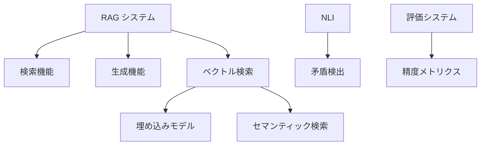

# 機能仕様書

## 1. CorpusManager（文書コーパス管理）

### アーキテクチャ概要

CorpusManagerは**複数段階パイプライン実行**による柔軟なコーパス構築システムです：

- **プリセット方式**: 初心者向けの事前定義済み構成
- **段階選択方式**: 中級者向けの必要段階のみ選択実行
- **完全カスタム方式**: 上級者向けの自由なパイプライン組み合わせ

### 基本ワークフロー（複数段階実行）


### インターフェース設計

#### 1. プリセット方式
```python
# シンプルRAG構成
corpus_manager = CorpusManager.create_simple_rag(doc_store, vector_store)
corpus_manager.build_corpus(["docs/*.pdf"])

# セマンティックRAG構成（辞書・正規化付き）
corpus_manager = CorpusManager.create_semantic_rag(doc_store, vector_store)
corpus_manager.build_corpus(["docs/*.pdf"])

# 知識グラフRAG構成（辞書・グラフ・正規化付き）
corpus_manager = CorpusManager.create_knowledge_rag(doc_store, vector_store)
corpus_manager.build_corpus(["docs/*.pdf"])
```

#### 2. 段階選択方式
```python
# 必要な段階のみを選択実行
corpus_manager.build_corpus(
    file_paths=["docs/*.pdf"],
    stages=["load", "dictionary", "normalize", "chunk", "vector"],
    stage_configs={
        "loader_config": LoaderConfig(file_types=["pdf", "docx"]),
        "dictionary_config": DictionaryMakerConfig(focus_on_technical_terms=True),
        "chunker_config": ChunkingConfig(chunk_size=512, overlap=50)
    }
)
```

#### 3. 完全カスタム方式
```python
# 複数パイプラインを明示的に定義
custom_pipelines = [
    # Stage 1: ファイル読み込み・保存
    DocumentPipeline([
        Loader(LoaderConfig(source_paths=["docs/*.pdf"])),
        DocumentStoreProcessor(doc_store)
    ]),
    # Stage 2: 辞書・グラフ作成
    DocumentPipeline([
        DocumentStoreLoader(doc_store, {"processing_stage": "original"}),
        MyCustomDictionaryMaker(),
        MyCustomGraphBuilder()
    ]),
    # Stage 3: 正規化・保存
    DocumentPipeline([
        DocumentStoreLoader(doc_store, {"processing_stage": "original"}),
        MyCustomNormalizer(),
        DocumentStoreProcessor(doc_store)
    ]),
    # Stage 4: チャンク化・ベクトル化
    DocumentPipeline([
        DocumentStoreLoader(doc_store, {"processing_stage": "normalized"}),
        MyCustomChunker(),
        MyCustomVectorProcessor()
    ])
]

corpus_manager.build_corpus(
    file_paths=["docs/*.pdf"],
    custom_pipelines=custom_pipelines
)
```

### プリセット構成一覧

| プリセット | 段階構成 | 用途 | 特徴 |
|---|---|---|---|
| **simple_rag** | Load → Chunk → Vector | 基本的なRAG | 高速、シンプル |
| **semantic_rag** | Load → Dictionary → Normalize → Chunk → Vector | 意味解析強化RAG | 表現統一、高精度 |
| **knowledge_rag** | Load → Dictionary → Graph → Normalize → Chunk → Vector | 知識グラフRAG | 関係性理解、複雑推論 |

### 段階選択オプション

| 段階名 | 処理内容 | 必須 | 依存関係 |
|---|---|---|---|
| **load** | ファイル読み込み・DocumentStore保存 | ✅ | なし |
| **dictionary** | LLMによる用語辞書作成 | ❌ | load |
| **graph** | LLMによる知識グラフ構築 | ❌ | load |
| **normalize** | 辞書ベース表現正規化 | ❌ | dictionary |
| **chunk** | 文書分割処理 | ✅ | load |
| **vector** | ベクトル埋め込み・保存 | ✅ | chunk |

### アプリケーションフロー図


## 2. QueryEngine（クエリ応答）

### アプリケーション手順

1. ユーザーがクエリを入力
2. クエリをEmbedderでベクトル化
3. RetrieverでVectorStoreから関連チャンクIDを検索
4. **DocumentStoreからチャンクIDに対応する完全なDocumentデータを取得**
5. Rerankerで検索結果を再ランキング
6. Readerでクエリとチャンクから回答を生成
7. **DocumentStoreから関連するオリジナル文書情報を取得してソース情報を充実**
8. 結果をユーザーに返却

### アプリケーションフロー図


## 3. QualityLab（品質評価）

### アプリケーション手順

1. ユーザーが評価データセットを指定
2. **DocumentStoreから評価対象文書を取得・フィルタリング**
3. TestSuiteで評価を実行
4. Evaluatorでメトリクスを集計
5. **DocumentStoreから文書系譜情報を取得して矛盾検出対象を特定**
6. ContradictionDetectorで文書間の矛盾を検出
7. InsightReporterで改善レポートを生成
8. **DocumentStoreに評価結果を保存**
9. 結果をユーザーに提供

### アプリケーションフロー図


## 4. Loader（ファイル読み込み）

### 機能詳細

- 対応ファイル形式：PDF, Word, Markdown, Text, HTML
- 非同期/並列処理対応（大規模コーパス向け）
- メタデータ抽出（作成日時、著者、タイトル等）

### 処理フロー


## 5. DictionaryMaker（ドメイン固有用語抽出・辞書更新）

### 機能詳細

- **既存辞書ファイル読み込み**: Markdown形式の用語辞書を読み取り
- **LLMベース用語抽出**: 文書ドメイン固有の重要用語をLLMで抽出
- **表現揺らぎ検出**: 同一概念の異なる表現パターンを検出
- **累積辞書更新**: 全文書を通じて1つのMarkdown辞書を段階的に更新

### 処理フロー


### 出力形式

```markdown
# ドメイン用語辞書

## 専門用語
- **RAG** (Retrieval-Augmented Generation): 検索拡張生成
  - 表現揺らぎ: 検索拡張生成、検索強化生成、RAGシステム
- **NLI** (Natural Language Inference): 自然言語推論
  - 表現揺らぎ: 自然言語推論、NLI推論、言語推論

## 技術概念
- **ベクトル検索**: 類似度に基づく文書検索手法
  - 表現揺らぎ: セマンティック検索、埋め込み検索、意味検索
```

## 6. Normalizer（表現揺らぎ正規化）

### 機能詳細

- **MD辞書ベース正規化**: DictionaryMakerが生成したMarkdown辞書を使用
- **表現揺らぎ統一**: 同一概念の異なる表現を標準形に統一
- **用語標準化**: ドメイン固有用語を統一された表現に置換

### 処理フロー


### 処理例

**入力文書:**
```
RAGシステムは検索強化生成の手法です。セマンティック検索により関連文書を見つけ、NLI推論で矛盾を検出します。
```

**正規化後:**
```
RAG（Retrieval-Augmented Generation）システムは検索拡張生成の手法です。ベクトル検索により関連文書を見つけ、NLI（Natural Language Inference）で矛盾を検出します。
```

## 7. GraphBuilder（知識グラフ累積構築）

### 機能詳細

- **既存グラフMD読み込み**: 既存のMarkdown形式知識グラフを読み取り
- **LLMベース関係抽出**: 用語辞書と文書からドメイン固有の重要な関係を抽出
- **グラフ累積更新**: 全文書を通じて1つのMarkdownグラフを段階的に構築
- **重複関係の統合**: 同一関係の重複を検出し統合

### 処理フロー


### 出力形式

```markdown
# ドメイン知識グラフ

## エンティティ関係

### RAG（検索拡張生成）
- **構成要素**
  - RAG → 含む → 検索機能
  - RAG → 含む → 生成機能
  - RAG → 使用する → ベクトル検索
  - RAG → 使用する → LLM

### ベクトル検索
- **技術関係**
  - ベクトル検索 → 基づく → 類似度計算
  - ベクトル検索 → 使用する → 埋め込みモデル
  - ベクトル検索 → 実現する → セマンティック検索

### 品質評価
- **評価手法**
  - RAG → 評価される → 精度メトリクス
  - NLI → 検出する → 文書間矛盾
  - 評価システム → 計算する → 信頼度スコア
```

### グラフ可視化



## 8. Chunker（文書分割）

### 機能詳細

- トークンベースの分割（デフォルト: 512トークン）
- オーバーラップ設定（デフォルト: 50トークン）
- 文境界を考慮した分割

### 設定パラメータ

| パラメータ | デフォルト値 | 説明 |
|---|---|---|
| chunk_size | 512 | 分割文書の最大トークン数 |
| overlap | 50 | 分割文書間のオーバーラップトークン数 |
| split_by_sentence | true | 文境界で分割するか |

## 9. Embedder（ベクトル化）

### 機能詳細

- 複数のEmbeddingモデル対応
- バッチ処理対応
- キャッシュ機能

### 対応モデル

| モデル | プロバイダ | 次元数 | 特徴 |
|---|---|---|---|
| TF-IDF | 内蔵 | 可変 | 軽量、オフライン動作 |
| text-embedding-ada-002 | OpenAI | 1536 | 高精度、多言語対応 |
| all-MiniLM-L6-v2 | HuggingFace | 384 | 高速、オープンソース |

## 10. StoreAdapter（ストレージ）

### 機能詳細

- 統一インターフェースで複数バックエンド対応
- CRUD操作
- 類似度検索

### 対応バックエンド

| バックエンド | 特徴 | 推奨用途 |
|---|---|---|
| InMemory | 高速、永続化なし | 開発・テスト |
| Chroma | 永続化対応、メタデータフィルタ | 小〜中規模 |
| Faiss | 高速検索、GPU対応 | 大規模本番環境 |

## 11. TestSuite（評価実行）

### 機能詳細

- 評価データセットの読み込み
- RAGパイプラインの自動実行
- 結果の記録

### 評価データセット形式

```json
{
  "test_cases": [
    {
      "id": "001",
      "query": "RAGシステムとは何ですか？",
      "expected_answer": "RAGシステムは検索拡張生成...",
      "relevant_docs": ["doc1.md", "doc2.md"]
    }
  ]
}
```

## 12. ContradictionDetector（矛盾検出）

### 機能詳細

- 文書からクレーム（主張）を抽出
- NLI（自然言語推論）による矛盾判定
- 矛盾スコアの計算

### 出力形式

```csv
doc1_id,doc2_id,claim1,claim2,contradiction_score
doc001,doc002,"RAGは高速である","RAGは低速である",0.95
```

## 13. InsightReporter（レポート生成）

### 機能詳細

- メトリクスの可視化
- 閾値を超えた問題の特定
- 改善提案の生成

### レポート構成

1. エグゼクティブサマリー
2. 全体メトリクス
3. 問題のある領域の特定
4. 改善提案
5. 詳細分析結果