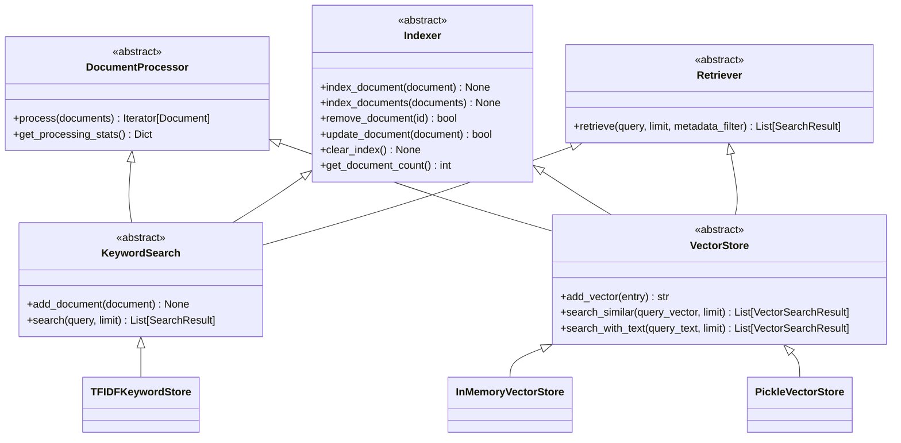

# KeywordSearch & VectorStore Interface Documentation

## Overview / 概要

This document provides comprehensive documentation for the KeywordSearch and VectorStore interfaces in the refinire-rag system. These interfaces provide unified APIs for document indexing, storage, and retrieval across different search implementations.

このドキュメントでは、refinire-ragシステムのKeywordSearchとVectorStoreインターフェースの包括的なドキュメントを提供します。これらのインターフェースは、異なる検索実装での文書インデックス、ストレージ、検索のための統一APIを提供します。

## Architecture Overview / アーキテクチャ概要

### Interface Hierarchy / インターフェース階層



## KeywordSearch Interface / キーワード検索インターフェース

### Overview / 概要

The `KeywordSearch` interface provides unified access to keyword-based document retrieval systems. It combines `DocumentProcessor`, `Indexer`, and `Retriever` capabilities for complete document processing and search functionality.

`KeywordSearch`インターフェースは、キーワードベースの文書検索システムへの統一アクセスを提供します。完全な文書処理と検索機能のために`DocumentProcessor`、`Indexer`、`Retriever`の機能を組み合わせています。

### Class Definition / クラス定義

```python
class KeywordSearch(DocumentProcessor, Indexer, Retriever):
    """Base class for keyword-based document search with DocumentProcessor integration"""
    
    def __init__(self, config: Optional[Dict[str, Any]] = None):
        """Initialize KeywordSearch with DocumentProcessor integration"""
        
    @classmethod
    @abstractmethod
    def get_config_class(cls) -> Type[Dict]:
        """Get the configuration class for this keyword search"""
        
    @abstractmethod
    def add_document(self, document: Document) -> None:
        """Add a document to the store"""
        
    @abstractmethod
    def search(self, query: str, limit: int = 10) -> List[SearchResult]:
        """Search for documents using keyword matching"""
```

### Core Methods / 主要メソッド

| Method | Purpose | Input | Output |
|--------|---------|--------|--------|
| `add_document()` | ストアに文書を追加 | `Document` | `None` |
| `search()` | キーワードマッチングで文書検索 | `query: str, limit: int` | `List[SearchResult]` |
| `retrieve()` | 詳細な検索（メタデータフィルタ付き） | `query: str, limit: int, metadata_filter: Dict` | `List[SearchResult]` |
| `index_document()` | 単一文書をインデックス | `Document` | `None` |
| `index_documents()` | 複数文書を効率的にインデックス | `List[Document]` | `None` |
| `remove_document()` | インデックスから文書を削除 | `document_id: str` | `bool` |
| `update_document()` | インデックスの既存文書を更新 | `Document` | `bool` |
| `clear_index()` | インデックスからすべての文書を削除 | - | `None` |
| `get_document_count()` | インデックス内の文書数を取得 | - | `int` |

### Usage Example / 使用例

```python
from refinire_rag.keywordstore import TFIDFKeywordStore
from refinire_rag.models.document import Document

# Initialize keyword store
keyword_store = TFIDFKeywordStore()

# Add documents
documents = [
    Document(id="doc1", content="Machine learning is a subset of artificial intelligence"),
    Document(id="doc2", content="Deep learning uses neural networks with multiple layers"),
    Document(id="doc3", content="Natural language processing deals with text understanding")
]

# Index documents
for doc in documents:
    keyword_store.add_document(doc)

# Search documents
results = keyword_store.search("machine learning", limit=5)
for result in results:
    print(f"ID: {result.document_id}, Score: {result.score}")
    print(f"Content: {result.document.content}")
```

### TFIDFKeywordStore Implementation / TFIDF実装

The default implementation uses TF-IDF (Term Frequency-Inverse Document Frequency) algorithm:

```python
class TFIDFKeywordStore(KeywordSearch):
    """TF-IDF based keyword search implementation"""
    
    def __init__(self, config: Optional[PluginConfig] = None):
        """Initialize TF-IDF keyword store"""
        
    def retrieve(self, query: str, limit: Optional[int] = None,
                metadata_filter: Optional[Dict[str, Any]] = None) -> List[SearchResult]:
        """Retrieve relevant documents using TF-IDF keyword search"""
        
    def index_document(self, document: Document) -> None:
        """Index a single document for TF-IDF search"""
```

**Features:**
- scikit-learn's TfidfVectorizer integration
- Cosine similarity scoring
- Metadata filtering support
- Configurable similarity thresholds
- Automatic index rebuilding

## VectorStore Interface / ベクトルストアインターフェース

### Overview / 概要

The `VectorStore` interface provides unified access to vector-based document storage and similarity search systems. It combines embedding generation, vector storage, and semantic search capabilities.

`VectorStore`インターフェースは、ベクトルベースの文書ストレージと類似検索システムへの統一アクセスを提供します。埋め込み生成、ベクトルストレージ、セマンティック検索機能を組み合わせています。

### Class Definition / クラス定義

```python
class VectorStore(DocumentProcessor):
    """Abstract base class for vector storage, retrieval, and indexing"""
    
    def __init__(self, config: Optional[Dict[str, Any]] = None):
        """Initialize VectorStore with DocumentProcessor integration"""
        
    def set_embedder(self, embedder):
        """Set the embedder for this vector store"""
        
    @abstractmethod
    def add_vector(self, entry: VectorEntry) -> str:
        """Add a vector entry to the store"""
        
    @abstractmethod
    def search_similar(self, query_vector: np.ndarray, limit: int = 10,
                      threshold: Optional[float] = None,
                      filters: Optional[Dict[str, Any]] = None) -> List[VectorSearchResult]:
        """Search for similar vectors"""
```

### Core Data Types / 主要データ型

#### VectorEntry

```python
@dataclass
class VectorEntry:
    """Represents a document with its embedding vector"""
    document_id: str
    content: str
    embedding: np.ndarray
    metadata: Dict[str, Any]
```

#### VectorSearchResult

```python
@dataclass
class VectorSearchResult:
    """Result from vector similarity search"""
    document_id: str
    content: str
    metadata: Dict[str, Any]
    score: float
    embedding: Optional[np.ndarray] = None
```

#### VectorStoreStats

```python
@dataclass
class VectorStoreStats:
    """Statistics for vector store"""
    total_vectors: int
    vector_dimension: int
    storage_size_bytes: int
    index_type: str = "exact"
```

### Core Methods / 主要メソッド

| Method | Purpose | Input | Output |
|--------|---------|--------|--------|
| `add_vector()` | ベクトルエントリをストアに追加 | `VectorEntry` | `str` |
| `add_vectors()` | 複数のベクトルエントリを追加 | `List[VectorEntry]` | `List[str]` |
| `get_vector()` | 文書IDでベクトルエントリを取得 | `document_id: str` | `Optional[VectorEntry]` |
| `update_vector()` | 既存のベクトルエントリを更新 | `VectorEntry` | `bool` |
| `delete_vector()` | 文書IDでベクトルエントリを削除 | `document_id: str` | `bool` |
| `search_similar()` | 類似ベクトルを検索 | `query_vector, limit, threshold, filters` | `List[VectorSearchResult]` |
| `search_with_text()` | テキストクエリで文書を検索 | `query_text, limit, threshold, filters` | `List[VectorSearchResult]` |
| `search_by_metadata()` | メタデータフィルタでベクトルを検索 | `filters, limit` | `List[VectorSearchResult]` |
| `count_vectors()` | オプションのフィルタに一致するベクトル数を取得 | `Optional[filters]` | `int` |
| `get_stats()` | ベクトルストア統計を取得 | - | `VectorStoreStats` |
| `clear()` | ストアからすべてのベクトルをクリア | - | `bool` |

### Convenience Methods / 便利メソッド

| Method | Purpose | Input | Output |
|--------|---------|--------|--------|
| `add_documents_with_embeddings()` | 文書と埋め込みを一緒に追加 | `documents, embeddings` | `List[str]` |
| `search_similar_to_document()` | 指定文書に類似する文書を検索 | `document_id, limit, exclude_self` | `List[VectorSearchResult]` |
| `get_vector_dimension()` | ベクトルの次元数を取得 | - | `Optional[int]` |

### Usage Example / 使用例

```python
from refinire_rag.storage.vector_store import VectorEntry
from refinire_rag.storage.in_memory_vector_store import InMemoryVectorStore
from refinire_rag.embedding.openai_embedder import OpenAIEmbedder
import numpy as np

# Initialize vector store and embedder
vector_store = InMemoryVectorStore()
embedder = OpenAIEmbedder()
vector_store.set_embedder(embedder)

# Create vector entries
entry1 = VectorEntry(
    document_id="doc1",
    content="Artificial intelligence and machine learning",
    embedding=embedder.embed_text("Artificial intelligence and machine learning"),
    metadata={"category": "AI", "year": 2024}
)

# Add vectors
vector_store.add_vector(entry1)

# Search with text
results = vector_store.search_with_text("deep learning neural networks", limit=5)
for result in results:
    print(f"ID: {result.document_id}, Score: {result.score}")
    print(f"Content: {result.content}")

# Search with vector
query_embedding = embedder.embed_text("machine learning algorithms")
results = vector_store.search_similar(query_embedding, limit=3)

# Search with metadata filters
filtered_results = vector_store.search_with_text(
    "AI research",
    limit=10,
    filters={"category": "AI", "year": 2024}
)
```

### Available Implementations / 利用可能な実装

#### InMemoryVectorStore

Fast in-memory vector storage with exact similarity search:

```python
class InMemoryVectorStore(VectorStore):
    """In-memory vector storage with exact similarity search"""
    
    def __init__(self, similarity_metric: str = "cosine", config: Optional[Dict] = None):
        """Initialize with cosine, euclidean, or dot product similarity"""
```

**Features:**
- Fast exact similarity search
- Multiple similarity metrics (cosine, euclidean, dot product)
- Good for development and small datasets
- No persistence (data lost on restart)

#### PickleVectorStore

Persistent file-based vector storage:

```python
class PickleVectorStore(VectorStore):
    """File-based vector storage using pickle serialization"""
    
    def __init__(self, file_path: str = "./vectors.pkl", config: Optional[Dict] = None):
        """Initialize with file-based persistence"""
```

**Features:**
- Persistent storage using pickle serialization
- Automatic save/load on startup
- Good for development and medium datasets
- Simple file-based backup and restore

## DocumentProcessor Integration / DocumentProcessor統合

Both KeywordSearch and VectorStore implement the `DocumentProcessor` interface, allowing them to be used in processing pipelines:

```python
from refinire_rag.processing.document_pipeline import DocumentPipeline
from refinire_rag.keywordstore import TFIDFKeywordStore
from refinire_rag.storage.in_memory_vector_store import InMemoryVectorStore

# Create processing pipeline
pipeline = DocumentPipeline()

# Add keyword indexing
keyword_store = TFIDFKeywordStore()
pipeline.add_processor(keyword_store)

# Add vector indexing
vector_store = InMemoryVectorStore()
vector_store.set_embedder(embedder)
pipeline.add_processor(vector_store)

# Process documents through both indexers
documents = [...]
processed_docs = pipeline.process(documents)

# Both stores now contain indexed documents
keyword_results = keyword_store.search("query text")
vector_results = vector_store.search_with_text("query text")
```

## Configuration / 設定

### Environment Variables / 環境変数

| Variable | Description | Default | Importance |
|----------|-------------|---------|-----------|
| `REFINIRE_RAG_TFIDF_KEYWORD_STORE_TOP_K` | Default top-K for TF-IDF search | "10" | 🟡 Important |
| `REFINIRE_RAG_TFIDF_KEYWORD_STORE_SIMILARITY_THRESHOLD` | Minimum similarity threshold | "0.0" | 🟢 Optional |
| `REFINIRE_RAG_VECTOR_STORE_SIMILARITY_METRIC` | Similarity metric for vector search | "cosine" | 🟢 Optional |
| `REFINIRE_RAG_VECTOR_STORE_DEFAULT_LIMIT` | Default search result limit | "10" | 🟢 Optional |
| `REFINIRE_RAG_VECTOR_STORE_CACHE_SIZE` | Vector cache size | "1000" | 🟢 Optional |

### Configuration Examples / 設定例

```python
# TF-IDF Configuration
tfidf_config = {
    "top_k": 20,
    "similarity_threshold": 0.1,
    "enable_filtering": True,
    "max_features": 10000,
    "ngram_range": (1, 2)
}
keyword_store = TFIDFKeywordStore(PluginConfig().for_plugin_type("keyword_store", tfidf_config))

# Vector Store Configuration
vector_config = {
    "similarity_metric": "cosine",
    "default_limit": 15,
    "auto_normalize": True
}
vector_store = InMemoryVectorStore(config=vector_config)
```

## Performance Characteristics / パフォーマンス特性

### KeywordSearch Performance / キーワード検索パフォーマンス

| Aspect | TFIDFKeywordStore | Characteristics |
|--------|-------------------|-----------------|
| **Indexing Speed** | Medium | Depends on vocabulary size |
| **Search Speed** | Fast | O(log n) with sparse matrices |
| **Memory Usage** | Medium | Stores TF-IDF matrix |
| **Accuracy** | Good | Exact keyword matching |
| **Best Use Cases** | Keyword search, filtering | Document categorization |

### VectorStore Performance / ベクトルストアパフォーマンス

| Aspect | InMemoryVectorStore | PickleVectorStore |
|--------|-------------------|-------------------|
| **Indexing Speed** | Very Fast | Medium (I/O bound) |
| **Search Speed** | Very Fast | Fast |
| **Memory Usage** | High | Medium |
| **Persistence** | None | File-based |
| **Scalability** | Limited by RAM | Limited by disk |
| **Best Use Cases** | Development, small datasets | Medium datasets, persistence |

## Common Patterns / 一般的なパターン

### Hybrid Search / ハイブリッド検索

Combine keyword and vector search for better results:

```python
def hybrid_search(query: str, keyword_store: KeywordSearch, 
                 vector_store: VectorStore, limit: int = 10):
    """Combine keyword and vector search results"""
    
    # Get keyword results
    keyword_results = keyword_store.search(query, limit=limit)
    
    # Get vector results
    vector_results = vector_store.search_with_text(query, limit=limit)
    
    # Combine and re-rank results
    combined_results = []
    seen_docs = set()
    
    # Add keyword results with boost
    for result in keyword_results:
        if result.document_id not in seen_docs:
            result.score = result.score * 1.2  # Boost keyword matches
            combined_results.append(result)
            seen_docs.add(result.document_id)
    
    # Add vector results
    for result in vector_results:
        if result.document_id not in seen_docs:
            combined_results.append(result)
            seen_docs.add(result.document_id)
    
    # Sort by score and return top results
    combined_results.sort(key=lambda x: x.score, reverse=True)
    return combined_results[:limit]
```

### Batch Processing / バッチ処理

Efficiently process large document collections:

```python
def batch_index_documents(documents: List[Document], 
                         keyword_store: KeywordSearch,
                         vector_store: VectorStore,
                         batch_size: int = 100):
    """Index documents in batches for better performance"""
    
    for i in range(0, len(documents), batch_size):
        batch = documents[i:i + batch_size]
        
        # Index in keyword store
        keyword_store.index_documents(batch)
        
        # Index in vector store
        vector_store.index_documents(batch)
        
        print(f"Processed batch {i//batch_size + 1}/{(len(documents)-1)//batch_size + 1}")
```

### Filtered Search / フィルタ検索

Use metadata filters for constrained search:

```python
def search_with_filters(query: str, store: Union[KeywordSearch, VectorStore],
                       category: str = None, date_range: tuple = None):
    """Search with metadata filters"""
    
    filters = {}
    if category:
        filters["category"] = category
    if date_range:
        filters["date"] = {"$gte": date_range[0], "$lte": date_range[1]}
    
    if isinstance(store, KeywordSearch):
        return store.retrieve(query, metadata_filter=filters)
    else:
        return store.search_with_text(query, filters=filters)
```

## Error Handling / エラーハンドリング

### Common Exceptions / 一般的な例外

```python
from refinire_rag.exceptions import StorageError

try:
    # Index documents
    keyword_store.index_documents(documents)
    vector_store.index_documents(documents)
    
except StorageError as e:
    logger.error(f"Storage error during indexing: {e}")
    # Handle storage-specific errors
    
except ValueError as e:
    logger.error(f"Invalid data during indexing: {e}")
    # Handle data validation errors
    
except Exception as e:
    logger.error(f"Unexpected error during indexing: {e}")
    # Handle unexpected errors
```

### Retry Logic / リトライロジック

```python
import time
from typing import Callable, Any

def retry_operation(operation: Callable, max_retries: int = 3, 
                   delay: float = 1.0) -> Any:
    """Retry operation with exponential backoff"""
    
    for attempt in range(max_retries):
        try:
            return operation()
        except Exception as e:
            if attempt == max_retries - 1:
                raise e
            
            wait_time = delay * (2 ** attempt)
            logger.warning(f"Operation failed (attempt {attempt + 1}), "
                          f"retrying in {wait_time}s: {e}")
            time.sleep(wait_time)
```

## Next: Plugin Development Guide / 次：プラグイン開発ガイド

For information on creating custom KeywordSearch and VectorStore implementations, see:
- [Plugin Development Guide](./plugin_development_guide.md)
- [Custom Keyword Store Implementation](./custom_keyword_store_guide.md)
- [Custom Vector Store Implementation](./custom_vector_store_guide.md)